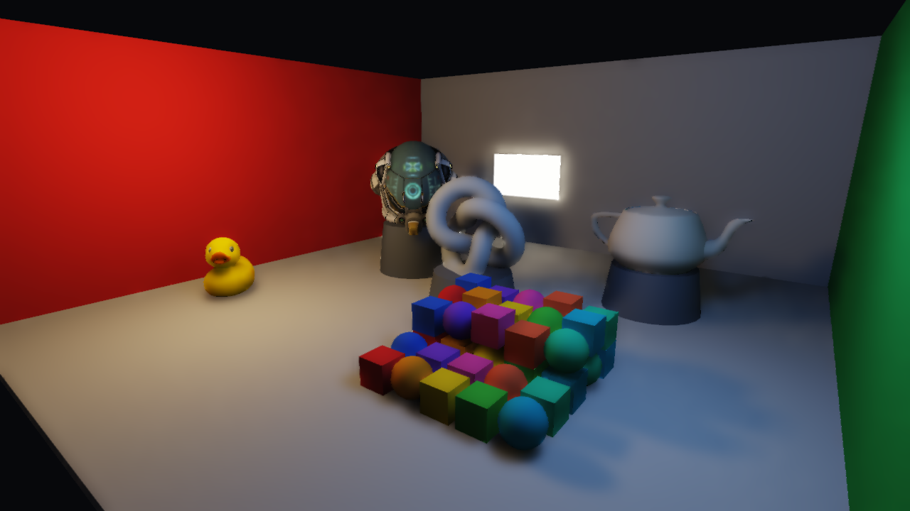
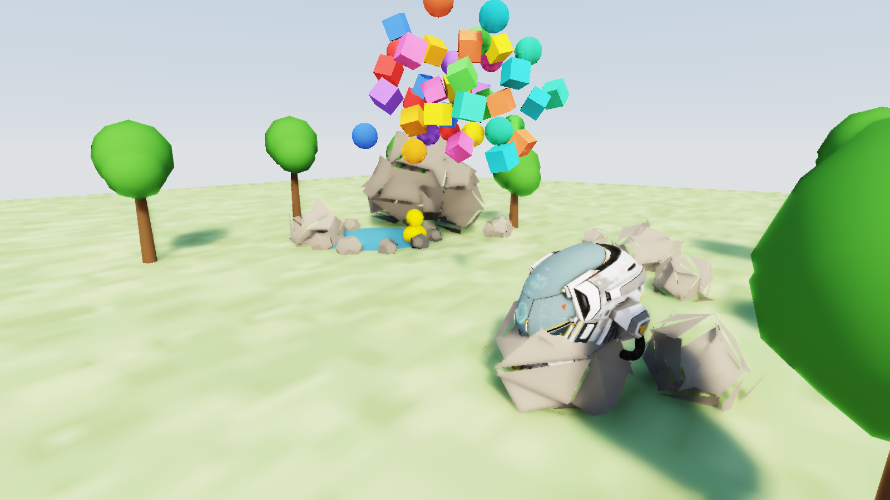

# three-realtime-rt

**Turn-on ray traced lighting for three.js.** Build your scene with ordinary
three.js — meshes, `MeshStandardMaterial`, `PointLight` / `DirectionalLight` —
then swap one render call and get BVH-traced **soft shadows**, **one-bounce
global illumination**, a **procedural sky** that lights the scene, and real-time
**temporal denoising + anti-aliasing**. Runs on plain WebGL2, no build step
required by consumers.

### ▶ [Live demo](https://goldwinxs.github.io/three-realtime-rt/) — drag to orbit, drop the pile, toggle every feature.

> **Support this project:** the [supporter pack on itch.io](https://goldwinxs.itch.io/three-realtime-rt-supporter-pack) gets you a ready-to-run starter template, all example scenes, and a 12-section deep-dive guide to how the whole pipeline works. The library itself is and stays MIT.



```js
import { RealtimeRaytracer } from "three-realtime-rt";

const rt = new RealtimeRaytracer(renderer);
rt.compileScene(scene);              // builds the BVH + material/light tables

// render loop — replace renderer.render(scene, camera) with:
rt.render(scene, camera);
```

That's the whole integration. Everything below is optional.

---

## Why "hybrid deferred" (the "RTX on" model)

Primary visibility is **rasterized** by three.js into a G-buffer — free, fast,
and pixel-perfect on materials and textures. Only the *lighting* is ray traced,
in a fragment shader, against a GPU BVH ([three-mesh-bvh]):

1. **G-buffer pass** — MRT: albedo+roughness, world normal+metalness, world
   position, emissive.
2. **RT lighting pass** — per pixel: soft shadow rays to each light (area
   sampled) + a 1-bounce cosine-weighted GI ray with next-event estimation. GI
   rays that escape sample the **procedural sky**, so the sky is a soft area
   light. Output is *demodulated irradiance* (albedo divided out) so it denoises
   cleanly while textures stay sharp.
3. **Temporal reprojection** — motion-validated history keeps samples alive as
   the camera and objects move.
4. **À-trous denoise** — an edge-avoiding (SVGF-lite) wavelet filter guided by
   the G-buffer, so 1 sample/pixel looks converged.
5. **Composite** — `albedo × irradiance + emissive`, distance fog, ACES tonemap.
6. **TAA** — sub-pixel jitter + a neighbourhood-clamped history resolve:
   supersampled anti-aliasing that also clears disocclusion speckles. This is
   the analytic (FSR2 / TAAU) approach, not a learned upscaler.

Lighting is traced at half resolution by default and reconstructed by a joint
bilateral upsample + the denoiser + TAA — the same "render few pixels, rebuild
temporally" idea DLSS uses, done with hand-written math.

## Moving objects (dynamic BVH)

Mark meshes as dynamic and their motion casts **correct ray traced shadows** —
the demo drops 40 rigid bodies (Rapier physics) that shadow each other and the
ground in real time:

```js
rt.compileScene(scene, { dynamicMeshes: crates });  // meshes that will move

// each frame, after you move them (e.g. after a physics step):
rt.updateDynamic();       // re-bakes them into the BVH (refit) — cheap
rt.render(scene, camera);
```

Under the hood this is a **two-level BVH**: static geometry lives in one BVH
uploaded to the GPU once at compile time, dynamic meshes in a second small BVH
that is re-baked and refit per frame. `updateDynamic()` therefore costs
~1 ms for dozens of moving objects *regardless of how big the static world is* —
skip it entirely on frames where nothing moved.

## Live lighting & sky

Lights can be toggled, moved, and recoloured every frame without recompiling:

```js
warmLight.visible = false;      // or change .color / .intensity / .position
rt.updateLights(scene);         // re-reads the scene's lights
```

The procedural sky doubles as the ambient light source:

```js
const rt = new RealtimeRaytracer(renderer, {
  sky: {
    enabled: true,
    sunDir: new THREE.Vector3(0.55, 0.62, 0.55).normalize(), // toward the sun
    sunColor: new THREE.Color(1.0, 0.92, 0.78),
    zenith:   new THREE.Color(0.20, 0.40, 0.72),
    horizon:  new THREE.Color(0.78, 0.85, 0.92),
    intensity: 1.0,
  },
  fog: { enabled: true, color: new THREE.Color(0.72, 0.8, 0.88), density: 0.03 },
});
```



## Options

| Option | Default | What |
|--------|---------|------|
| `renderScale` | `0.5` | Lighting resolution vs. the G-buffer. `1.0` = max quality. |
| `taa` | `true` | Temporal anti-aliasing (jitter + neighbourhood clamp). |
| `denoise` | `true` | Edge-aware à-trous denoiser. |
| `gi` | `true` | 1-bounce global illumination (vs. direct-only). |
| `temporalReprojection` | `true` | Keep samples across camera/object motion. |
| `maxHistory` | `128` | History cap — higher is smoother, slower to react. |
| `fireflyClamp` | `4.0` | Clamp on indirect luminance to suppress fireflies. |
| `sky` | *off* | Procedural sky as background + GI ambient (see above). |
| `fog` | *off* | Distance fog, composited before tonemap. |

Per-light: set `light.userData.rtRadius` for soft-shadow size. Set
`mesh.userData.rtExclude = true` to keep a mesh out of the BVH (it still
rasterizes and gets lit — useful for water / translucent surfaces).

## Running the demo

```bash
npm install
npm run dev       # http://localhost:8115
```

The demo ([`examples/`](examples/)) is an ordinary three.js app — see
[`examples/main.js`](examples/main.js) for the full, commented integration
(scene → physics → compile → render loop). `npm run deploy` builds and publishes
it to GitHub Pages.

## Roadmap

| Stage | Status | What |
|-------|--------|------|
| 1. Core | ✅ | Scene→GPU sync, BVH, G-buffer, traced shadows + 1-bounce GI, accumulation |
| 2. Reprojection | ✅ | Motion-validated history — samples survive camera motion |
| 3. Denoiser | ✅ | Edge-avoiding à-trous (SVGF-lite) → clean 1spp |
| 4. TAA | ✅ | Sub-pixel jitter + neighbourhood-clamped resolve → AA, no speckles |
| 4b. Sky | ✅ | Procedural sky as background + GI ambient light source |
| 5. Two-level BVH | ✅ | Static BVH uploaded once; movers in a small per-frame BVH → dynamic shadows at ~1 ms |
| 6. Specular | — | Glossy reflections + refractive water; npm publish |

## Credits

- [three-mesh-bvh] by Garrett Johnson — the GPU BVH this is built on.
- Inspired by [Erich Loftis'][erichlof] `THREE.js-PathTracing-Renderer`.
- Demo models: Khronos glTF sample assets (Damaged Helmet, Duck).

## License

MIT © Goldwin Stewart

[three-mesh-bvh]: https://github.com/gkjohnson/three-mesh-bvh
[erichlof]: https://github.com/erichlof/THREE.js-PathTracing-Renderer
