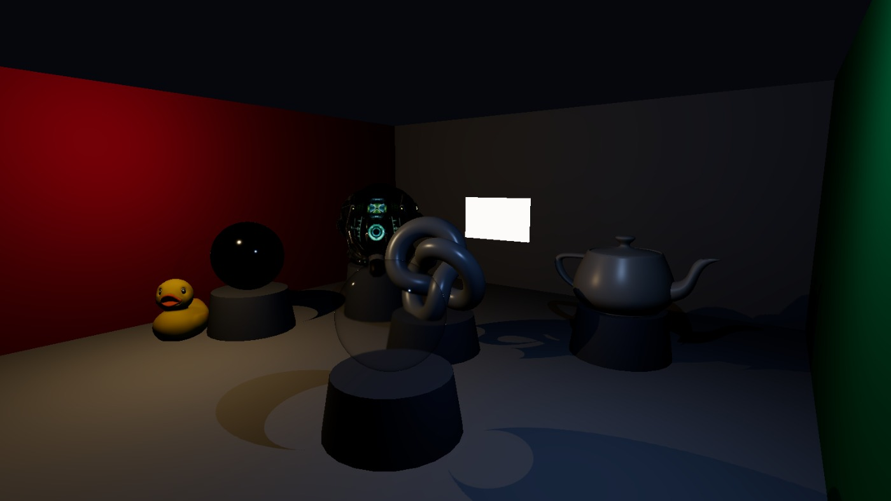
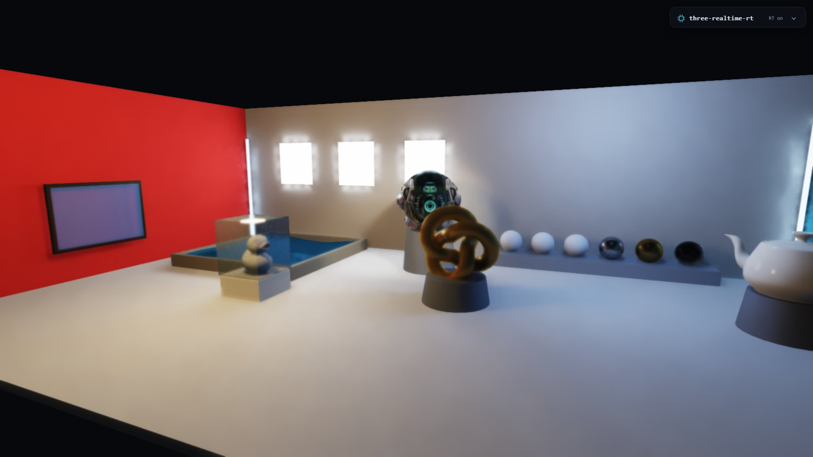

# three-realtime-rt

**Turn-on ray traced lighting for three.js.** Build your scene with ordinary
three.js — meshes, `MeshStandardMaterial`, `PointLight` / `DirectionalLight` —
then swap one render call and get BVH-traced **soft shadows**, **one-bounce
global illumination**, **emissive-mesh area lights**, **mirror/glossy
reflections**, **glass refraction**, **volumetric god rays** (BVH-shadowed
single scatter, not a screen-space trick), a **procedural sky** that lights
the scene, **ReSTIR many-light sampling** (flat cost in light count),
**blue-noise sampling**, and real-time **temporal denoising + anti-aliasing**.
Runs on plain WebGL2.

The library ships as **untranspiled ES modules** (the `src/` folder) — it has no
build step of its own, so you consume it through your bundler (Vite, webpack,
esbuild, …) or a browser import map that resolves the bare `three` /
`three-mesh-bvh` specifiers. MIT licensed.
[On npm](https://www.npmjs.com/package/three-realtime-rt): `npm i three-realtime-rt three three-mesh-bvh`.

### ▶ [Live demo](https://goldwinxs.github.io/three-realtime-rt/) — drag to orbit, drop the pile, toggle every feature.

> **Support this project:** the [supporter pack on itch.io](https://goldwinxs.itch.io/three-realtime-rt-supporter-pack) gets you a ready-to-run starter template, all example scenes, and a 12-section deep-dive guide to how the whole pipeline works. The library itself is and stays MIT.


Same scene, same camera, same lights — plain three.js (shadow maps + ACES) on
the left, `rt.render` on the right:

| Rasterized three.js | three-realtime-rt |
|---|---|
|  |  |

## Getting started

Install the library plus its two **peer dependencies** — you bring your own copy
of `three` and `three-mesh-bvh`:

```bash
npm i three-realtime-rt three three-mesh-bvh
```

No bundler? [`standalone.html`](standalone.html) is a single copy-paste file
that runs the raytracer via CDN import maps — open it from any static server.

A complete, copy-pasteable minimal app — a lit sphere on a floor, one point light:

```js
import * as THREE from "three";
import { RealtimeRaytracer } from "three-realtime-rt";

// 1. An ordinary three.js renderer. Size it BEFORE constructing the raytracer —
//    it reads the drawing-buffer size at construction.
const renderer = new THREE.WebGLRenderer({ antialias: false });
renderer.setPixelRatio(window.devicePixelRatio);
renderer.setSize(window.innerWidth, window.innerHeight);
document.body.appendChild(renderer.domElement);

// 2. An ordinary scene: meshes with MeshStandardMaterial + a real light.
const scene = new THREE.Scene();
const camera = new THREE.PerspectiveCamera(
  60, window.innerWidth / window.innerHeight, 0.1, 100
);
camera.position.set(0, 2, 6);

scene.add(new THREE.Mesh(
  new THREE.SphereGeometry(1, 48, 48),
  new THREE.MeshStandardMaterial({ color: 0xdddddd, roughness: 0.4, metalness: 0.0 })
));
const floor = new THREE.Mesh(
  new THREE.PlaneGeometry(20, 20),
  new THREE.MeshStandardMaterial({ color: 0x808080, roughness: 1.0 })
);
floor.rotation.x = -Math.PI / 2;
floor.position.y = -1;
scene.add(floor);

const light = new THREE.PointLight(0xffffff, 40);   // Point / Spot / Directional (up to 32)
light.position.set(3, 5, 2);
scene.add(light);

// 3. Turn on ray tracing.
const rt = new RealtimeRaytracer(renderer);
rt.compileScene(scene);              // builds the BVH + material/light tables

// 4. Resize: pass DRAWING-BUFFER (device) pixels, not CSS pixels.
addEventListener("resize", () => {
  camera.aspect = window.innerWidth / window.innerHeight;
  camera.updateProjectionMatrix();
  renderer.setSize(window.innerWidth, window.innerHeight);
  const db = renderer.getDrawingBufferSize(new THREE.Vector2());
  rt.setSize(db.x, db.y);
});

// 5. Render loop — replace renderer.render(scene, camera) with rt.render.
function loop() {
  requestAnimationFrame(loop);
  rt.render(scene, camera);
}
loop();
```

On hardware that can't trace, `rt.render` transparently falls back to
`renderer.render` — no capability branch needed (see [Running everywhere](#running-everywhere-capability-tiers)).

### Integrating into an existing app

A checklist for dropping the tracer into a scene you already have:

1. **Swap the render call** — `renderer.render(scene, camera)` →
   `rt.render(scene, camera)`. Construct the `RealtimeRaytracer` once, *after*
   the renderer has its final size.
2. **Compile once; recompile after structural changes** — `rt.compileScene(scene)`
   bakes geometry into a static BVH and snapshots materials + emissive area
   lights. Call it again after you add/remove meshes, swap geometry, or change a
   material's `emissive` / `color` / `roughness` / `metalness`.
3. **Declare movers** — pass moving meshes to
   `rt.compileScene(scene, { dynamicMeshes: [...] })`, then call
   `rt.updateDynamic()` each frame after you move them (e.g. after a physics
   step). Skip it on frames where nothing moved.
4. **Update lights when they change** — after moving, toggling (`.visible`),
   recolouring or dimming a light, call `rt.updateLights(scene)`. No recompile.
5. **Resize** — in your resize handler, after `renderer.setSize(...)`, call
   `rt.setSize(width, height)` with **drawing-buffer (device) pixels**
   (`renderer.getDrawingBufferSize(...)`).
6. **Reset after jumps** — call `rt.resetAccumulation()` after a camera teleport
   or a scene cut, so stale temporal history doesn't ghost.

That's the whole integration. Everything below is optional.

---

## Why "hybrid deferred" (the "RTX on" model)

Primary visibility is **rasterized** by three.js into a G-buffer — free, fast,
and pixel-perfect on materials and textures. Only the *lighting* is ray traced,
in a fragment shader, against a GPU BVH ([three-mesh-bvh]):

1. **G-buffer pass** — MRT: albedo+roughness, world normal+metalness, world
   position, emissive.
2. **RT lighting pass** — per pixel: soft shadow rays to each light (area
   sampled) + a 1-bounce cosine-weighted GI ray with next-event estimation. GI
   rays that escape sample the **procedural sky**, so the sky is a soft area
   light. **Emissive meshes are real area lights**: their triangles are sampled
   directly (NEE with the area→solid-angle pdf), so a glowing panel casts soft
   light and shadows instead of waiting for a lucky GI ray to hit it. Metallic
   pixels trace a **mirror/glossy reflection ray**; transmissive pixels trace a
   Fresnel-weighted **reflection + two-interface refraction**. Output is
   *demodulated irradiance* (albedo divided out) so it denoises cleanly while
   textures stay sharp.
3. **Temporal reprojection** — motion-validated history keeps samples alive as
   the camera and objects move.
4. **À-trous denoise** — an edge-avoiding (SVGF-lite) wavelet filter guided by
   the G-buffer, so 1 sample/pixel looks converged.
5. **Composite** — `albedo × irradiance + emissive`, distance fog, ACES tonemap.
6. **TAA** — sub-pixel jitter + a neighbourhood-clamped history resolve:
   supersampled anti-aliasing that also clears disocclusion speckles. This is
   the analytic (FSR2 / TAAU) approach, not a learned upscaler.

Lighting is traced at half resolution by default and reconstructed by a joint
bilateral upsample + the denoiser + TAA — the same "render few pixels, rebuild
temporally" idea DLSS uses, done with hand-written math.

## Moving objects (dynamic BVH)

Mark meshes as dynamic and their motion casts **correct ray traced shadows** —
the demo drops 40 rigid bodies (Rapier physics) that shadow each other and the
ground in real time:

```js
rt.compileScene(scene, { dynamicMeshes: crates });  // meshes that will move

// each frame, after you move them (e.g. after a physics step):
rt.updateDynamic();       // re-bakes them into the BVH (refit) — cheap
rt.render(scene, camera);
```

Under the hood this is a **two-level BVH**: static geometry lives in one BVH
uploaded to the GPU once at compile time, dynamic meshes in a second small BVH
that is re-baked and refit per frame. `updateDynamic()` therefore costs
~1 ms for dozens of moving objects *regardless of how big the static world is* —
skip it entirely on frames where nothing moved.

## Live lighting & sky

Lights can be toggled, moved, and recoloured every frame without recompiling:

```js
warmLight.visible = false;      // or change .color / .intensity / .position
rt.updateLights(scene);         // re-reads the scene's lights
```

The procedural sky doubles as the ambient light source:

```js
const rt = new RealtimeRaytracer(renderer, {
  sky: {
    enabled: true,
    sunDir: new THREE.Vector3(0.55, 0.62, 0.55).normalize(), // toward the sun
    sunColor: new THREE.Color(1.0, 0.92, 0.78),
    zenith:   new THREE.Color(0.20, 0.40, 0.72),
    horizon:  new THREE.Color(0.78, 0.85, 0.92),
    intensity: 1.0,
  },
  fog: { enabled: true, color: new THREE.Color(0.72, 0.8, 0.88), density: 0.03 },
});
```


## What is and isn't supported

Primary visibility is rasterized into a G-buffer, so **whatever three.js draws,
you still see** — the ray tracer computes only the *lighting*, reading a
deliberately small, fixed slice of the material and light model. The one place
the G-buffer diverges from a plain three.js draw is transparency: it is a
**single-layer deferred blend** (see the `transparent` row below and the
Rendering-model notes), not three.js's per-fragment sorted over-blend. This is
the honest map of what actually feeds the traced lighting.

### Materials

Lighting reads the **first material only** on a multi-material mesh, pulling the
scalar fields of `MeshStandardMaterial` / `MeshPhysicalMaterial` (Basic / Lambert
/ Phong contribute whatever of those fields they have).

| Property | Feeds lighting? | Notes |
|----------|-----------------|-------|
| `color` + `map` | ✅ | Albedo = `color × map.rgb`. Textures stay sharp (irradiance is demodulated, then re-multiplied). |
| `roughness` | ✅ | **Scalar only.** Drives shadow / GI softness and reflection sharpness. |
| `metalness` | ✅ | **Scalar only.** Metallic pixels trace a reflection ray. |
| `emissive` | ✅ | A *static* emissive mesh becomes a real **area light** (NEE) — casts soft light + shadows. |
| `emissiveMap` | ⚠️ visible only | A map-masked emissive **glows on screen** but the map **zeroes its area-light table** — it lights nothing. Use a flat `emissive` colour (no map) for an emitter that should illuminate. |
| `transmission` (Physical) | ✅ | Glass: Fresnel reflection + two-interface refraction. |
| `transparent` + `opacity` | ✅ | Alpha blend: the surface is composited over the geometry behind it (a straight-through traced ray), weighted by scalar `opacity` and **tinted by `color`/`map`**. Single layer — nearest transparent surface wins, overlapping panes don't inter-sort. Kept out of the BVH, so it casts no shadow. Toggle with `transparency`. |
| `opacity` on an opaque material | ❌ | Only read when `transparent: true`; an opaque material always writes at full coverage. |
| `roughnessMap` / `metalnessMap` | ❌ | Only the scalar `roughness` / `metalness` are used; these maps are ignored by lighting. |
| `normalMap` | ❌ | Lighting uses geometric normals; normal maps don't perturb shading. |
| `clearcoat`, `sheen`, `iridescence` | ❌ | Not modelled. |
| vertex colors | ❌ | Not read into albedo. |
| per-material `ior` | ❌ | Refraction uses the single **global** `rt.ior` (default 1.5), never `material.ior`. |
| 2nd+ material of a group | ❌ | Only `material[0]` of a multi-material mesh reaches the G-buffer and BVH. |

### Lights

| Light | Supported | Notes |
|-------|-----------|-------|
| `PointLight` | ✅ | `light.userData.rtRadius` (default `0.15`) sets soft-shadow size. |
| `DirectionalLight` | ✅ | `light.userData.rtRadius` (default `0.02`) sets sun softness; keep its direction in sync with `sky.sunDir`. |
| Emissive meshes | ✅ static | Sampled directly as area lights. **Dynamic** emitters are *not* in the NEE list — they light only via GI-ray hits. |
| `SpotLight` | ✅ | Cone + penumbra respected; soft shadows via `rtRadius`; visible light cones in volumetric fog. |
| `RectAreaLight` | ❌ | Use an emissive mesh instead. |
| `HemisphereLight` / `AmbientLight` | ❌ | Ignored — the procedural `sky` (or `envColor`) provides ambient. |

- Up to **32** point/directional lights (`MAX_LIGHTS`); further lights are dropped.
- Moving, toggling, recolouring or dimming a light → `rt.updateLights(scene)` (cheap, no recompile).
- Changing a mesh's **emissive** (it's an area light baked at compile time) → `rt.compileScene(...)` again.
- Emissive area lights are capped at **256 triangles** (largest by area kept, with a console warning) — prefer low-poly emitter meshes.

### Geometry & occlusion

- Every non-excluded visible mesh is **merged into one static BVH at compile time**. Add / remove geometry → recompile.
- Meshes that move must be declared via `dynamicMeshes` and driven with `updateDynamic()`. Anything not declared is treated as static — moving it on screen won't move its traced shadow.
- **Transparent materials never occlude** (by design — a glass case shouldn't cast an opaque shadow). They still rasterize normally.
- **`alphaTest` cut-outs** (`transparent: false`) *do* occlude — but as **full triangles**, not per-texel, so their shadows are blocky.
- `mesh.userData.rtExclude = true` removes a mesh from the BVH entirely (it still rasterizes and gets lit) — handy for water / translucent surfaces.

### Rendering model

- **1-bounce GI + direct light.** No multi-bounce diffuse, no caustics, no specular-chain paths.
- **Reflections** are a single traced bounce into a **diffuse-shaded** view of the world — no recursive mirror-in-mirror; a metal shows its surroundings, not a second full render.
- **Refraction** is two-interface (front + back) with a single global IOR — convincing glass, not a spectral / dispersive renderer.
- **Volumetric** is **single-scatter** god rays, not multiple-scattering fog.
- **Transparency** is a **single-layer deferred blend**: a `transparent` surface writes as the nearest layer of the G-buffer and the lighting pass composites it over the geometry behind by tracing one straight-through ray. The behind-radiance is fully lit (direct + 1-bounce GI) and tinted by the pane's albedo. Overlapping transparent surfaces do **not** inter-sort (only the nearest is kept), and there is no per-pixel back-to-front over-blend of many layers as in raster three.js. Turn it off with `transparency: false` (blend surfaces then render fully opaque).

### Platform

- Requires **WebGL2 + `EXT_color_buffer_float`**. Software rasterizers (SwiftShader / llvmpipe) are treated as unsupported.
- On anything unsupported, `rt.supported === false` and `rt.render()` **falls back to `renderer.render()`** after one console warning — your app still runs everywhere. Branch yourself with `rt.supported` or `RealtimeRaytracer.isSupported(renderer)` if you want.
- WebGL2 only; no WebGPU backend (on the roadmap).

## Options

| Option | Default | What |
|--------|---------|------|
| `renderScale` | `0.5` | Lighting resolution vs. the G-buffer. `1.0` = max quality. |
| `taa` | `true` | Temporal anti-aliasing (jitter + neighbourhood clamp). |
| `denoise` | `true` | Edge-aware à-trous denoiser. |
| `gi` | `true` | 1-bounce global illumination (vs. direct-only). |
| `emissiveNEE` | `true` | Sample static emissive meshes as area lights (next-event estimation). Off = emitters only light via lucky GI rays. |
| `reflections` | `true` | Traced mirror/glossy reflections on metallic surfaces (sharpest at `renderScale: 1`). |
| `refraction` | `true` | Traced two-interface refraction for `MeshPhysicalMaterial.transmission` surfaces. |
| `transparency` | `true` | Alpha-blended transparency: composite `transparent` meshes over the geometry behind them (single-layer, weighted by `opacity`, tinted by albedo). Off = they render fully opaque. |
| `restir` | `true` | ReSTIR direct lighting: per-pixel reservoirs with temporal + spatial reuse, one visibility ray regardless of light count. Flat cost in light count; cuts emissive area-light noise. |
| `ior` | `1.5` | Index of refraction used by `refraction`. |
| `volumetric` | *off* | Physically-based god rays: single-scatter fog, one BVH-shadowed light sample per lighting pixel per frame, temporally accumulated. `{ enabled, density, maxDist, zones }`, where `zones` is an optional array of up to 8 AABBs `{ min:[x,y,z], max:[x,y,z], density }` that add localized fog on top of (or instead of) the global `density`. |
| `stochasticLights` | `false` | One direct shadow ray per pixel per frame (random source) instead of one per light. |
| `temporalReprojection` | `true` | Keep samples across camera/object motion. |
| `maxHistory` | `128` | History cap — higher is smoother, slower to react. |
| `fireflyClamp` | `4.0` | Clamp on indirect luminance to suppress fireflies. |
| `sky` | *off* | Procedural sky as background + GI ambient (see above). |
| `fog` | *off* | Distance fog, composited before tonemap. |

Per-light: set `light.userData.rtRadius` for soft-shadow size. Set
`mesh.userData.rtExclude = true` to keep a mesh out of the BVH (it still
rasterizes and gets lit — useful for water / translucent surfaces).
Transparent materials never act as occluders (a glass case shouldn't cast an
opaque shadow); `alphaTest` cut-outs still do.

## Running everywhere (capability tiers)

Nothing adaptive is imposed — everything below is **opt-in**:

- **No usable GPU** (missing WebGL2 float targets, or a software rasterizer
  like SwiftShader): the library logs one console warning and `rt.render()`
  silently falls back to plain `renderer.render()`. Your app runs everywhere
  with zero capability checks; query `rt.supported` or the static
  `RealtimeRaytracer.isSupported(renderer)` if you want to branch yourself.
- **Tier presets**: `RealtimeRaytracer.detectTier(renderer)` returns
  `"none" | "mid" | "high"`, and `recommendedOptions(tier)` gives matching
  constructor options — spread them, then override what you like:

  ```js
  const tier = RealtimeRaytracer.detectTier(renderer);
  const rt = new RealtimeRaytracer(renderer, {
    ...RealtimeRaytracer.recommendedOptions(tier),
    targetFps: 55,
  });
  ```

- **Adaptive quality** (`adaptiveQuality: true`, default **false**): continuous
  dynamic resolution scaling. Watches real frame time and steers the lighting
  resolution smoothly toward `targetFps` (in 5% steps with a cooldown), pairing
  low resolutions with MORE denoise passes (they run at lighting res, so
  they're nearly free exactly where they're needed) and stochastic direct
  light. While enabled it drives `renderScale` / `stochasticLights` /
  `denoiseIterations`; turn it off for manual control.
- **`stochasticLights: true`** (default false): one direct shadow ray per
  pixel per frame instead of one per light — the biggest ray-count lever for
  many-light scenes and mobile GPUs.

WebGPU: not used as a backend (this is a WebGL2 library); a WGSL compute
backend is on the roadmap.

## Running the demo

```bash
npm install
npm run dev       # http://localhost:8115
```

The demo ([`examples/`](examples/)) is an ordinary three.js app — see
[`examples/main.js`](examples/main.js) for the full, commented integration
(scene → physics → compile → render loop). `npm run deploy` builds and publishes
it to GitHub Pages.

## Gallery & benchmarks

[`gallery.html`](gallery.html) drops the raytracer into **stock glTF scenes it
was never authored for** — LittlestTokyo, Lantern, Antique Camera, BoomBox,
Corset, Water Bottle, and the Damaged Helmet — streamed straight from their
public hosts (no assets committed). A one-button toggle A/Bs ray tracing against
plain rasterized three.js with an fps + triangle readout, and a compact options
strip exposes GI / emissive NEE / reflections / refraction / ReSTIR / denoise /
TAA / volumetric plus lighting-resolution and auto-quality controls.

[`bench.html?autorun=1`](bench.html) runs a matrix of feature configs with
GPU-**fence-timed** frame costs and a temporal **ghosting metric**, writing each
run's results to [`bench-results/`](bench-results/) for tracking regressions.

## Roadmap

| Stage | Status | What |
|-------|--------|------|
| 1. Core | ✅ | Scene→GPU sync, BVH, G-buffer, traced shadows + 1-bounce GI, accumulation |
| 2. Reprojection | ✅ | Motion-validated history — samples survive camera motion |
| 3. Denoiser | ✅ | Edge-avoiding à-trous (SVGF-lite) → clean 1spp |
| 4. TAA | ✅ | Sub-pixel jitter + neighbourhood-clamped resolve → AA, no speckles |
| 4b. Sky | ✅ | Procedural sky as background + GI ambient light source |
| 5. Two-level BVH | ✅ | Static BVH uploaded once; movers in a small per-frame BVH → dynamic shadows at ~1 ms |
| 5b. Area lights | ✅ | Emissive meshes sampled directly (NEE) — glowing panels cast soft light + shadows |
| 6. Specular | ✅ | Mirror/glossy reflections on metals + two-interface glass refraction |
| 6b. Sampling | ✅ | Blue-noise sampling + ReSTIR direct lighting (temporal + spatial reuse) |
| 6c. Any-hit shadows | ✅ | Unordered early-out BVH traversal for occlusion rays — same image, up to ~2× cheaper shadows |
| 7. Publish | — | npm publish; refractive water; per-material IOR |

## Credits

- [three-mesh-bvh] by Garrett Johnson — the GPU BVH this is built on.
- Inspired by [Erich Loftis'][erichlof] `THREE.js-PathTracing-Renderer`.
- Demo models: Khronos glTF sample assets (Damaged Helmet, Duck).

## License

MIT © Goldwin Stewart

[three-mesh-bvh]: https://github.com/gkjohnson/three-mesh-bvh
[erichlof]: https://github.com/erichlof/THREE.js-PathTracing-Renderer
