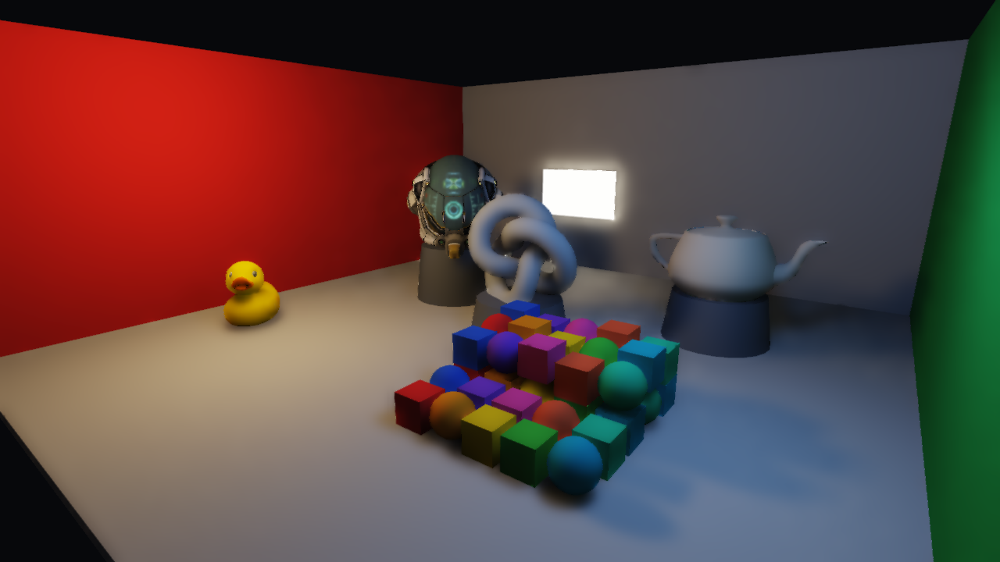
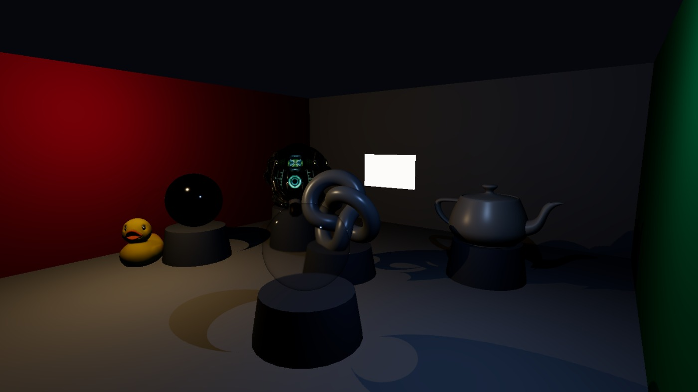
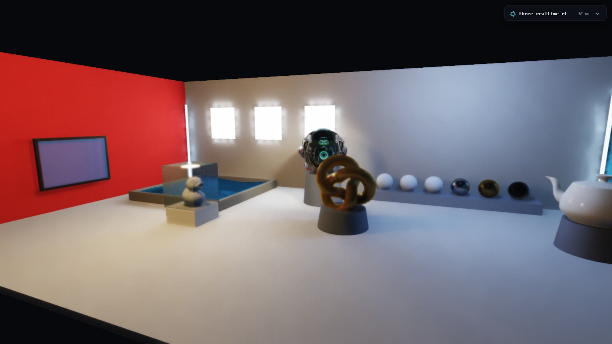
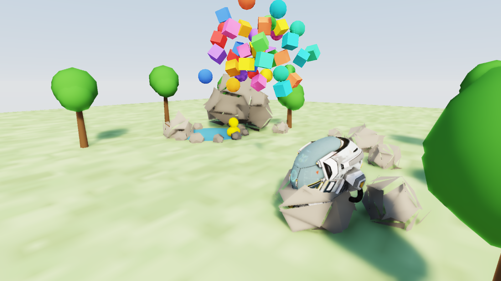

# three-realtime-rt

**Turn-on ray traced lighting for three.js.** Build your scene with ordinary
three.js — meshes, `MeshStandardMaterial`, `PointLight` / `DirectionalLight` —
then swap one render call and get BVH-traced **soft shadows**, **one-bounce
global illumination**, **emissive-mesh area lights**, **mirror/glossy
reflections**, **glass refraction**, **volumetric god rays** (BVH-shadowed
single scatter, not a screen-space trick), a **procedural sky** that lights
the scene, **ReSTIR many-light sampling** (flat cost in light count),
**blue-noise sampling**, and real-time **temporal denoising + anti-aliasing**.
Runs on plain WebGL2.

This round adds **GGX PBR specular** — Cook-Torrance dielectric highlights in a
separate specular buffer, so `roughness` finally matters on non-metals — plus
**normal / roughness / metalness maps**, **alpha-blended transparency**
(single-layer deferred blend), **deforming dynamic meshes** (a mirror-water pool
whose traced reflections follow the live wave surface), **overscan** to hide
leading-edge convergence noise while the camera turns, and **emissive importance
sampling** (area × luminance) for calmer area lights. The zero-config renderer
now ships **conservative, self-scaling defaults** — it starts low-but-ray-traced
and an on-by-default governor scales quality up toward `targetFps`; an optional
async **GPU tier probe** reads real WebGPU adapter limits for a smarter starting
point.

The library ships as **untranspiled ES modules** (the `src/` folder) — it has no
build step of its own, so you consume it through your bundler (Vite, webpack,
esbuild, …) or a browser import map that resolves the bare `three` /
`three-mesh-bvh` specifiers. MIT licensed.
[On npm](https://www.npmjs.com/package/three-realtime-rt): `npm i three-realtime-rt three three-mesh-bvh`.

### ▶ [Live demo](https://goldwinxs.github.io/three-realtime-rt/) — drag to orbit, drop the pile, toggle every feature.

> **Support this project:** the [supporter pack on itch.io](https://goldwinxs.itch.io/three-realtime-rt-supporter-pack) gets you a ready-to-run starter template, all example scenes, and a 12-section deep-dive guide to how the whole pipeline works. The library itself is and stays MIT.



Same scene, same camera, same lights — plain three.js (shadow maps + ACES) on
the left, `rt.render` on the right:

| Rasterized three.js | three-realtime-rt |
|---|---|
|  |  |

## Getting started

Install the library plus its two **peer dependencies** — you bring your own copy
of `three` and `three-mesh-bvh`:

```bash
npm i three-realtime-rt three three-mesh-bvh
```

No bundler? [`standalone.html`](standalone.html) is a single copy-paste file
that runs the raytracer via CDN import maps — open it from any static server.

A complete, copy-pasteable minimal app — a lit sphere on a floor, one point light:

```js
import * as THREE from "three";
import { RealtimeRaytracer } from "three-realtime-rt";

// 1. An ordinary three.js renderer. Size it BEFORE constructing the raytracer —
//    it reads the drawing-buffer size at construction.
const renderer = new THREE.WebGLRenderer({ antialias: false });
renderer.setPixelRatio(window.devicePixelRatio);
renderer.setSize(window.innerWidth, window.innerHeight);
document.body.appendChild(renderer.domElement);

// 2. An ordinary scene: meshes with MeshStandardMaterial + a real light.
const scene = new THREE.Scene();
const camera = new THREE.PerspectiveCamera(
  60, window.innerWidth / window.innerHeight, 0.1, 100
);
camera.position.set(0, 2, 6);

scene.add(new THREE.Mesh(
  new THREE.SphereGeometry(1, 48, 48),
  new THREE.MeshStandardMaterial({ color: 0xdddddd, roughness: 0.4, metalness: 0.0 })
));
const floor = new THREE.Mesh(
  new THREE.PlaneGeometry(20, 20),
  new THREE.MeshStandardMaterial({ color: 0x808080, roughness: 1.0 })
);
floor.rotation.x = -Math.PI / 2;
floor.position.y = -1;
scene.add(floor);

const light = new THREE.PointLight(0xffffff, 40);   // Point / Spot / Directional (up to 32)
light.position.set(3, 5, 2);
scene.add(light);

// 3. Turn on ray tracing.
const rt = new RealtimeRaytracer(renderer);
rt.compileScene(scene);              // builds the BVH + material/light tables

// 4. Resize: pass DRAWING-BUFFER (device) pixels, not CSS pixels.
addEventListener("resize", () => {
  camera.aspect = window.innerWidth / window.innerHeight;
  camera.updateProjectionMatrix();
  renderer.setSize(window.innerWidth, window.innerHeight);
  const db = renderer.getDrawingBufferSize(new THREE.Vector2());
  rt.setSize(db.x, db.y);
});

// 5. Render loop — replace renderer.render(scene, camera) with rt.render.
function loop() {
  requestAnimationFrame(loop);
  rt.render(scene, camera);
}
loop();
```

On hardware that can't trace, `rt.render` transparently falls back to
`renderer.render` — no capability branch needed (see [Running everywhere](#running-everywhere-capability-tiers)).

> **Defaults are conservative.** Zero-config construction
> (`new RealtimeRaytracer(renderer)`) starts *low but still ray traced* — half
> lighting resolution, stochastic direct light, a lean denoise — so it runs
> acceptably on weak discrete and integrated GPUs out of the box. The adaptive
> governor is **on by default** and scales quality **up** toward `targetFps`
> when it measures headroom (a strong desktop climbs to full-resolution
> lighting within a couple of seconds). Want to start higher, or pin a level?
> Pass `RealtimeRaytracer.recommendedOptions(RealtimeRaytracer.detectTier(renderer))`
> (or `probeGPUTier()` — see [Running everywhere](#running-everywhere-capability-tiers)),
> or explicit options.

### Integrating into an existing app

A checklist for dropping the tracer into a scene you already have:

1. **Swap the render call** — `renderer.render(scene, camera)` →
   `rt.render(scene, camera)`. Construct the `RealtimeRaytracer` once, *after*
   the renderer has its final size.
2. **Compile once; recompile after structural changes** — `rt.compileScene(scene)`
   bakes geometry into a static BVH and snapshots materials + emissive area
   lights. Call it again after you add/remove meshes, swap geometry, or change a
   material's `emissive` / `color` / `roughness` / `metalness`. <a id="empty-scene"></a>Calling it on a
   scene with **no meshes yet** is a **no-op** (it warns once and keeps any
   previously compiled scene), so "construct the tracer, then add meshes" is a
   valid order — until meshes are added and recompiled, `rt.render()` falls back
   to plain rasterization (no crash, no black screen). Call it **explicitly**: if
   `render()` finds no compiled scene it compiles one itself, with *no options*,
   so everything is static (it warns once — `implicit-compile`).
3. **Declare movers** — pass moving meshes to
   `rt.compileScene(scene, { dynamicMeshes: [...] })`, then call
   `rt.updateDynamic()` each frame after you move them (e.g. after a physics
   step). Skip it on frames where nothing moved.
4. **Update lights when they change** — after moving, toggling (`.visible`),
   recolouring or dimming a light, call `rt.updateLights(scene)`. No recompile.
5. **Resize** — in your resize handler, after `renderer.setSize(...)`, call
   `rt.setSize(width, height)` with **drawing-buffer (device) pixels**
   (`renderer.getDrawingBufferSize(...)`).
6. **Reset after jumps** — call `rt.resetAccumulation()` after a camera teleport
   or a scene cut, so stale temporal history doesn't ghost.

That's the whole integration. Everything below is optional.

---

## Why "hybrid deferred" (the "RTX on" model)

Primary visibility is **rasterized** by three.js into a G-buffer — free, fast,
and pixel-perfect on materials and textures. Only the *lighting* is ray traced,
in a fragment shader, against a GPU BVH ([three-mesh-bvh]):

1. **G-buffer pass** — MRT: albedo+roughness, world normal+metalness, world
   position, emissive.
2. **RT lighting pass** — per pixel: soft shadow rays to each light (area
   sampled) + a 1-bounce cosine-weighted GI ray with next-event estimation. GI
   rays that escape sample the **procedural sky**, so the sky is a soft area
   light. **Emissive meshes are real area lights**: their triangles are sampled
   directly (NEE with the area→solid-angle pdf), so a glowing panel casts soft
   light and shadows instead of waiting for a lucky GI ray to hit it. Metallic
   pixels trace a **mirror/glossy reflection ray**; transmissive pixels trace a
   Fresnel-weighted **reflection + two-interface refraction**. Output is
   *demodulated irradiance* (albedo divided out) so it denoises cleanly while
   textures stay sharp.
3. **Temporal reprojection** — motion-validated history keeps samples alive as
   the camera and objects move.
4. **À-trous denoise** — an edge-avoiding (SVGF-lite) wavelet filter guided by
   the G-buffer, so 1 sample/pixel looks converged.
5. **Composite** — `albedo × irradiance + emissive`, distance fog, ACES tonemap.
6. **TAA** — sub-pixel jitter + a neighbourhood-clamped history resolve:
   supersampled anti-aliasing that also clears disocclusion speckles. This is
   the analytic (FSR2 / TAAU) approach, not a learned upscaler.

Lighting is traced at half resolution by default and reconstructed by a joint
bilateral upsample + the denoiser + TAA — the same "render few pixels, rebuild
temporally" idea DLSS uses, done with hand-written math.

### Debug views

Set `rt.outputMode` (the demo's **view** dropdown) to inspect a single stage
instead of the composited image:

| Mode | View | Shows |
|------|------|-------|
| `0` | composite | Final tonemapped image (default). |
| `1` | albedo | G-buffer base colour. |
| `2` | normals | World-space normals, `×0.5 + 0.5`. |
| `3` | irradiance | Demodulated diffuse lighting (direct + GI), pre-albedo. |
| `4` | world pos | World position, `fract(p × 0.1)`. |
| `5` | emissive | G-buffer emissive. |
| `6` | specular | The dielectric specular buffer. |
| `7` | **bvh cost** | Heatmap of how many BVH nodes this pixel's shadow rays visit. |

**Reading the BVH-cost heatmap.** Mode 7 counts, per pixel, the total BVH nodes
visited by every shadow ray the lighting pass casts that frame (the ReSTIR
winner / stochastic / per-light rays, plus reflection and glass occlusion rays),
and maps the count through a cold→hot palette: **blue is cheap** (few boxes),
through green and yellow, to **red and white for the most expensive** pixels. Hot
regions mean many box tests per shadow ray — dense or overlapping geometry, long
thin triangles whose bounding boxes overlap wastefully, or rays skimming almost
parallel to a surface (they thread a long corridor of the tree before they
either hit or escape). It bypasses temporal blending and the denoiser, so it is a
raw per-frame snapshot. `rt.costScale` sets the mapping (default `1/96`, so ~96
visits saturate to white); the demo's **cost scale** slider drives it as
"visits-to-saturate" so you can rescale the range to your scene.

## Moving objects (dynamic BVH)

Mark meshes as dynamic and their motion casts **correct ray traced shadows** —
the demo drops 40 rigid bodies (Rapier physics) that shadow each other and the
ground in real time:

```js
rt.compileScene(scene, { dynamicMeshes: crates });  // meshes that will move

// each frame, after you move them (e.g. after a physics step):
rt.updateDynamic();       // re-bakes them into the BVH (refit) — cheap
rt.render(scene, camera);
```

Under the hood this is a **two-level BVH**: static geometry lives in one BVH
uploaded to the GPU once at compile time, dynamic meshes in a second small BVH
that is re-baked and refit per frame. `updateDynamic()` therefore costs
~1 ms for dozens of moving objects *regardless of how big the static world is* —
skip it entirely on frames where nothing moved.

### Deforming meshes (water, cloth)

By default a dynamic mesh is **rigid**: its vertices are snapshotted at compile
time and only re-transformed by `mesh.matrixWorld` each frame — so CPU edits to
its `position` attribute show in the rasterized image but the *traced* rays
(shadows, GI, reflections) still hit the original shape. For a mesh whose
vertices actually move on the CPU (a water surface, cloth, a morph target), set
`userData.rtDeforming` so the raytracer re-reads its live geometry every frame:

```js
water.userData.rtDeforming = true;           // opt in
rt.compileScene(scene, { dynamicMeshes: [water, ...crates] });

// each frame:
deformWaterVertices(water.geometry, t);       // your CPU wave/cloth solver
water.geometry.attributes.position.needsUpdate = true;
water.geometry.computeVertexNormals();        // REQUIRED — see below
rt.updateDynamic();                            // re-reads the live vertices
rt.render(scene, camera);
```

Two requirements:

- **You own the normals.** The tracer reads the mesh's live `normal` attribute
  for deforming segments — it does not recompute them. Call
  `geometry.computeVertexNormals()` (or update the attribute yourself) after
  moving the vertices, or the shading/reflections will track the old silhouette.
- **The vertex count is fixed at compile time.** Deforming an existing surface is
  free; changing its topology (adding/removing vertices) is not — `updateDynamic()`
  throws with a clear message telling you to `compileScene()` again.

**Cost model.** A deforming segment is re-baked from its live vertices every
frame and its normals are re-uploaded every frame (rigid movers amortize the
normal upload over 8 frames). Both are O(dynamic triangles), and the cheap
per-frame BVH `refit()` (kept for surfaces that stay roughly in place, like a
water plane) is O(dynamic tris) too — so **keep deforming meshes low-poly**. A
`48×48` plane is ≈ 4.6k triangles, which refits in well under a millisecond; a
`256×256` plane (~131k tris) will dominate the frame. The demo's mirror-water
pool is a `48×48` plane.

### Skinned meshes (animated characters)

A `SkinnedMesh` is **auto-detected** — just list it in `dynamicMeshes` (no
`userData` flag) and it is CPU-skinned into the dynamic BVH every frame, so an
animated character casts a **traced shadow that moves with its gait** and
rasterizes in its animated pose (not bind pose) in the G-buffer:

```js
rt.compileScene(scene, { dynamicMeshes: [...crates, foxMesh] }); // foxMesh.isSkinnedMesh

// each frame:
mixer.update(dt);                 // advance the AnimationMixer
foxRoot.updateMatrixWorld(true);  // pose the skeleton (bones -> world matrices) NOW
rt.updateDynamic();               // CPU-skins the live pose into the BVH
rt.render(scene, camera);
```

- **Skin the pose before `updateDynamic()`.** The CPU skinning reads each bone's
  `matrixWorld` (via three's `SkinnedMesh.applyBoneTransform` / `getVertexPosition`,
  which apply the bind matrix, bone weights and bone matrices), so the skeleton
  must be posed for this frame first. `mixer.update(dt)` then a forced
  `updateMatrixWorld` on the character root does that — otherwise the traced
  shadow lags the raster by a frame. (three r160's `applyBoneTransform` returns
  the vertex in the mesh's **local/bind-relative** space; the tracer applies
  `matrixWorld` itself, exactly like a rigid mover.)
- **Two sampler-friendly shortcuts.** Skinning is done for the mesh's *unique*
  source vertices once per frame (shared triangle-soup slots reuse the result),
  and secondary-ray **normals are per-face** — recomputed from the skinned
  triangle positions rather than CPU-skinning the normal attribute. Flat-shaded
  secondary rays are indistinguishable for shadows/GI, and **primary visibility
  still gets smooth normals from the raster path** (the G-buffer skins the normal
  properly via three's own `skinnormal_vertex` chunk). If your character's
  geometry ships without a `normal` attribute (some glTF do — e.g. the Khronos
  Fox), call `geometry.computeVertexNormals()` once after load so the raster path
  has bind-pose normals to skin.

**Cost model.** CPU skinning is O(source verts × 4 bones) with zero per-vertex
allocation, plus the usual O(dynamic tris) BVH refit and normal upload. Budget
~**10–20k total skinned source vertices to stay sub-2 ms**; the demo's Fox is
≈ 1.7k source verts and skins in ≈ 0.3 ms. As with any dynamic mesh, keep the
skinned tris low and there is no static-world cost.

## Volumetric surface albedo (world-space 3D-texture colour)

Colour a surface by a **world-space 3D texture** sampled at the ray hit point,
instead of a flat colour or a 2D UV map. This is how you paint a **volumetric data
field** — stress, temperature, density, a distance field — onto a mesh in a path
tracer, where a custom fragment shader can't run. Opt a material in through
`userData`, and the tracer samples your (already colour-mapped) `Data3DTexture` for
that surface's albedo in **both** primary visibility (the G-buffer, so the
raster/hybrid view agrees) **and** the traced GI / reflection bounces (so the
field's colours bleed correctly through global illumination):

```js
import * as THREE from "three";

// An RGB(A) 3D texture you have ALREADY colour-mapped (the tracer samples .rgb —
// it contains no colormap logic). RGBA8 is fine; no float-filtering required.
const field = new THREE.Data3DTexture(rgbaBytes, N, N, N); // your data
field.format = THREE.RGBAFormat;
field.type = THREE.UnsignedByteType;
field.needsUpdate = true;

// Map the volume into world space: origin = world position of the texel-(0,0,0)
// corner, size = the world extent of the whole volume. A mesh's world AABB is the
// natural choice, so the field fills the mesh.
mesh.updateMatrixWorld(true);
const box = new THREE.Box3().setFromObject(mesh);
mesh.material.userData.rtVolumeAlbedo = {
  texture: field,
  origin: box.min.clone(),
  size:   box.getSize(new THREE.Vector3()),
};

rt.compileScene(scene);   // detects the opt-in; recompile after adding/changing it
```

At the hit point `p`, the tracer computes `uvw = clamp((p - origin) / size, 0, 1)`
and samples the texture **trilinearly** (it sets `LinearFilter` + `ClampToEdge` on
your texture at compile time). The sampled RGB **replaces the base albedo**;
`roughness`, `metalness` and `emissive` still compose normally. Updating the
texture **data** later (an animated field) needs only `texture.needsUpdate = true`
— no recompile; changing which material carries the field, or its `origin` / `size`,
needs a `compileScene()`.

**Demo:** [`volumetric-albedo.html`](volumetric-albedo.html) — a torus knot coloured
by a procedural 3D noise field (turbo colormap) under an emissive area light, with
the field's colours bleeding onto white walls through GI.

**v1 is single-volume for the traced-bounce path.** Any number of materials may
carry distinct volumes and each renders correctly in **primary visibility**; the
GI / reflection **bounce** samples only the first registered volume. The reason is
the sampler budget: the lighting megakernel already binds the WebGL2-guaranteed
minimum of **16** fragment samplers, and this feature's bounce path adds one
`sampler3D` (the 17th). It is compiled in only when a scene uses the feature **and**
the GPU exposes ≥ 17 fragment texture units (`MAX_TEXTURE_IMAGE_UNITS` — most
desktop GPUs report 32). On a bare-minimum 16-unit device the bounces fall back to
the material's flat base colour (a one-time `console.info`), while primary
visibility still shows the full field. The whole feature is behind a compile-time
`RT_VOLUME_ALBEDO` define that is **off unless a volume material is registered**, so
scenes that don't use it compile byte-identical shaders. Multi-volume bounces are
future work — the `userData` API doesn't preclude them. One more edge: the
**experimental** `restirGI` path (off by default) resolves the indirect bounce in
its own kernel and does **not** yet sample the volume — a volume surface's
*indirect* contribution falls back to its flat colour while `restirGI` is on (the
default inline-GI path carries the field correctly).

## Coloured shadows (`absorptionShadows`)

A shadow ray that crosses an **absorbing** glass material is attenuated `exp(-σ·d)` per RGB channel over the distance it spends inside, instead of being blocked outright. Stained glass spills tinted light onto the floor; a lightbox behind stacked translucent bodies lights what is in front of them instead of turning them into a black silhouette; clear glass (a glass material with no `attenuationDistance`) stops casting a shadow at all, which is the physically right answer. It is the shadow-ray half of the [Beer-Lambert absorption](#materials) feature and uses the same per-material σ — set `attenuationColor` + a finite `attenuationDistance` (or `userData.rtAttenuation`) and it just works.

```js
const rt = new RealtimeRaytracer(renderer);      // absorptionShadows defaults to true
rt.absorptionShadows = false;                    // opt out (recompiles the lighting shader)
```

**How it works.** An ordered closest-hit march along the shadow ray with an explicit current-medium state, capped at 8 interface events. It is deliberately *not* the cheaper trick of an unordered any-hit pass that adds σ on front faces and subtracts it on back faces: real multi-body geometry (a 3D-print stack, any pair of touching solids) contains interfaces where only one of two coincident walls survives, so entry/exit events don't pair up and a signed sum produces **negative** optical depth — optical gain and bright halos. The march cannot, however unbalanced the interfaces are. Hitting the 8-event cap returns the transmittance accumulated so far, so the failure mode is a slightly-off tint, never a black silhouette.

**Where it does *not* act (v1).** Worth reading before you rely on it:

- **The ReSTIR visibility ray.** With `restir: true` (the default), primary direct lighting is shaded by the reservoir winner's own visibility ray, which stays **binary**. So on the default settings you will see coloured shadows in the GI bounce and through reflections/refractions, but *not* on the primary surface's direct light. Turn `restir` off to get them on direct lighting. This is a real energy inconsistency between the two paths, not a rounding difference.
- **The volumetric march.** `VolumetricPass` in-scatter samples still use a binary occlusion test, so god-rays through tinted glass are not tinted.
- **Refraction.** Shadow rays travel in a straight line; they are not bent at the interfaces. Standard approximation — the light would have to be re-solved through the bent path.
- **Partial transmission.** Any material with `transmission > 0` is treated as fully transmissive *to shadow rays* (it attenuates by σ only). A `transmission: 0.5` surface does not half-block.
- Interfaces are classified with the interpolated attribute normal rather than a true geometric normal, which can mis-class a segment inside a smooth surface's silhouette band.

**Cost — this one is not free.** Unlike the view-path absorption it extends, coloured shadows replace a *bounded, unordered, early-outing any-hit* traversal with an *unbounded ordered closest-hit* traversal on every next-event shadow ray, and that is a large constant. Measured on an RTX 3060, museum scene, 1280×720 canvas at `renderScale 0.5`, full stack (GI + emissive + reflections + refraction), fence-timed medians:

| | `restir: true` (default) | `restir: false` |
|---|---|---|
| absorbing scene, `absorptionShadows: false` | 68.8 ms | 79.9 ms |
| absorbing scene, `absorptionShadows: true` | 82.7 ms | 108.5 ms |
| **cost** | **+13.8 ms** | **+28.7 ms** |

The `restir: false` column is the honest one — it is the configuration in which the feature actually acts on primary direct light, and there it costs roughly a third of the frame. Profiling with the event cap forced to 1 attributes ~21 ms of that 28.7 ms to the any-hit → closest-hit swap alone and the remainder to the extra marching past glass interfaces; the cost therefore scales with how many shadow rays you cast, not with how much glass is on screen. Treat it as a setting a user can turn off (the demo has a **"tinted shadows"** sub-toggle next to **"tinted glass"** for exactly that A/B), not as something to leave on by default in a shipping frame budget you have not measured.

**Zero cost when unused, provably.** With no absorbing material in the compiled scene — or with `absorptionShadows: false` — the marked lines are stripped and the lighting megakernel's source is **byte-identical** to the build without the feature (verified both at the module level and live via `getShaderSource` against a master checkout; the measured frame-time difference is −0.03 ms, i.e. nothing). No new samplers (the pass sits at the WebGL2 16-sampler minimum), no new uniforms, no new `traceRadiance` call sites; the "is this glass" flag rides an already-allocated channel of the absorption row.

Regression rig: [`absorption.html`](absorption.html) — phase 2 puts two overlapping slabs under a high lamp and asserts the receiving floor shows each slab's `attenuationColor` where it alone is overhead and their **product** where they overlap (measured within 5% of analytic, product relation within 2.2%), with a phase-3 A/B that turns the feature off and requires the same columns to go black.

## Scattering — translucent solids (`kmScattering`)

Jade. Wax. Marble and alabaster. Soap, milky plastic, a leaf held up to the sun, a lampshade. These are the materials a real-time renderer normally cannot do honestly, because what makes them look the way they do is light that goes *into* the surface, bounces around, and comes back out — and every cheap approximation of that is an authored fake. The usual one is a hand-painted **thickness map**, which stops being right the moment the object deforms, gets sliced, or is seen from a new angle.

This computes it instead. Give a material an absorption coefficient **K** and a scattering coefficient **S**, and the renderer measures how far each view ray actually travels inside the real geometry and solves the **Kubelka-Munk two-flux** equations for that thickness. No thickness map. No per-object tuning. A sphere thins out correctly toward its silhouette, a shell wall reads brighter where it is seen obliquely, and a body that gets deformed or replaced keeps looking right, because nothing about the appearance was baked.

```js
const stone = new THREE.MeshPhysicalMaterial({
  color: 0xffffff,          // white — K and S carry the pigment (see below)
  transmission: 1.0,        // translucent to the tracer, NOT `transparent`
  roughness: 0.35,
  ior: 1.5,
});
// K, the absorption half: the colour that survives 25 cm of travel.
stone.userData.rtAttenuation = { color: [0.0002, 0.186, 0.0098], distance: 0.25 };
// S, the scattering half: 1/world-unit, directly...
stone.userData.rtScattering = { coefficient: 20 };
// ...or authored the same way as K — 14% of the flux still going straight after 10 cm.
stone.userData.rtScattering = { color: [0.14, 0.14, 0.14], distance: 0.1 };

const rt = new RealtimeRaytracer(renderer, { kmScattering: true }); // default false
```

**This is not volumetric lighting.** Fog, god-rays and atmospheric haze are light scattering *between* objects and live in [`volumetrics`](#options); this is light transport *inside* solid bodies. They are unrelated features and you can run either, both, or neither.

**Picking K and S.** The model is invertible, which is the whole point of a physical parameterization: for a body thick enough to hide whatever is behind it, the reflectance is `R_inf = 1/(a + b)` with `a = 1 + K/S` and `b = sqrt(a² − 1)`, which rearranges to **`K/S = (1 − R)² / (2R)`**. Decide what colour the material should be when thick, read off K/S per channel, pick S for how quickly it gets there, and the thin parts follow automatically. The maths is exported so you can do this at build time or in a tool:

```js
import { kmReflectance, kmReflectanceInfinite, kmStackRGB } from "three-realtime-rt";
kmReflectanceInfinite(6, 20);        // masstone of this channel
kmReflectance(6, 20, 0.004, 0.85);   // 4 mm of it over an 85%-reflective backing
```

**What it does.**

- **Front-lit reflectance.** The headline. Under absorption alone a pigmented translucent body can only ever *subtract* light, so it renders as dark murk; with scattering it looks like its colour, lit from the front, the way the real material does.
- **Transmitted light.** Shadow rays crossing a scattering body are attenuated by the two-flux transmittance instead of Beer-Lambert, so a lamp lights the table through its shade, dimmer and warmer than absorption alone predicts. White pigment stops getting the free ride it gets under absorption-only, where a zero σ means a perfectly clear shadow.
- **See-through.** What is behind the body comes through weighted by that same transmittance — which is why a bulb inside a shade makes the shade glow.

**Limitations in v1 — read these, they are the difference between this and subsurface scattering.**

- **No lateral bleed.** This is 1-D transport *along the ray*: light leaves where it entered. Real subsurface scattering spreads light sideways inside the material, which is what gives a thin edge its glow and skin its softness. You will not get that here. A thin edge is thin *along the view ray* and reads correctly bright, but light that entered somewhere else does not travel to it.
- **No in-scattering into shadow rays.** A lit body does not add light to its own shadow, and it does not glow into the volume around it.
- **`R` is used as the diffuse albedo under `N·L` lighting.** Kubelka-Munk derives `R` under *diffuse* illumination; using it as an albedo lit by point sources is the standard engineering approximation (it is what every KM-based paint and print pipeline does). Exact in the diffuse-ambient limit, slightly over-bright at grazing incidence.
- **One medium along the view path.** Layered stacks are composed correctly along *shadow* rays, but the view path evaluates a single entry-to-exit chord. See the note below for why, and `kmStackRGB` for the full layered composition on the CPU.
- **Requires `refraction: true`**, for the same structural reason.
- **Thin bodies.** The tracer starts its in-medium trace `2 × eps` inside the surface, so a body (or a shell wall) thinner than that cannot resolve its own exit face. `eps` auto-scales with scene size — roughly 7 cm in a 24 m room — so either keep bodies chunky or set `eps` explicitly **as a constructor option** (assigning `rt.eps` afterwards is silently overwritten on the next compile).
- **Base colour should be white.** `R` *is* the diffuse albedo, and the composite multiplies it by the material's `color`. A non-white colour tints the computed pigment on top of itself; the compiler warns.

**Why one medium on the view path.** The design this shipped from had a dedicated ordered march along the view ray, composing an arbitrary layered stack — the same machinery coloured shadows use. It works, and it cannot be compiled: NVIDIA's native-GL assembler rejects the megakernel with `error: too many temporaries`, the register-pressure sibling of the `C5041` failure that killed a shadow-march optimisation in 0.9.0. Bisected on the GPU: full feature **35 319** lines of generated assembly → fails; shadow-side maths removed, **33 403** → still fails; the march compiled but never called → links. The march's own BVH traversal is the blocker, and no amount of shrinking the surrounding arithmetic buys it back. Reusing the shadow march for the view ray is *worse* — it is already inlined at roughly eight effective sites, so a third explicit call adds a ninth traversal. The shipped version evaluates the layer where the shader already computes an in-medium view chord: no new traversal, no new sampler, no new `traceRadiance` call site.

**Zero cost when unused, provably.** With `kmScattering: false`, or with no material carrying `userData.rtScattering`, the marked lines are stripped and the lighting megakernel's source is **byte-identical** to the 0.9.0 build — SHA-256 checked against a `master` checkout by `npm run test:km`, which also runs 23 numeric checks on the analytic reference (the `S → 0` degrade to Beer-Lambert, the `t → ∞` approach to `R_inf` from both sides, the `coth` guard at tiny `b·S·t`, channel independence, a 1344-case finiteness sweep, and the equivalence of the closed form with the forward composition).

Validation rig: [`scattering.html`](scattering.html) renders pigments of known K and S and divides by a white Lambert patch under the same directional light — which cancels exposure and units exactly — then compares against the CPU reference. A 10/20/40/80/160 mm slab staircase agrees within **1.5%**, and a sphere probed centre-to-rim within **1–8%**, with the thickness taken from the geometry rather than authored anywhere.

## Live lighting & sky

Lights can be toggled, moved, and recoloured every frame without recompiling:

```js
warmLight.visible = false;      // or change .color / .intensity / .position
rt.updateLights(scene);         // re-reads the scene's lights
```

The procedural sky doubles as the ambient light source:

```js
const rt = new RealtimeRaytracer(renderer, {
  sky: {
    enabled: true,
    sunDir: new THREE.Vector3(0.55, 0.62, 0.55).normalize(), // toward the sun
    sunColor: new THREE.Color(1.0, 0.92, 0.78),
    zenith:   new THREE.Color(0.20, 0.40, 0.72),
    horizon:  new THREE.Color(0.78, 0.85, 0.92),
    intensity: 1.0,
  },
  fog: { enabled: true, color: new THREE.Color(0.72, 0.8, 0.88), density: 0.03 },
});
```



## What is and isn't supported

Primary visibility is rasterized into a G-buffer, so **whatever three.js draws,
you still see** — the ray tracer computes only the *lighting*, reading a
deliberately small, fixed slice of the material and light model. The one place
the G-buffer diverges from a plain three.js draw is transparency: it is a
**single-layer deferred blend** (see the `transparent` row below and the
Rendering-model notes), not three.js's per-fragment sorted over-blend. This is
the honest map of what actually feeds the traced lighting.

### Materials

Lighting reads the scalar fields of `MeshStandardMaterial` / `MeshPhysicalMaterial`
(Basic / Lambert / Phong contribute whatever of those fields they have). A
**multi-material mesh** (`mesh.material` is an array + `geometry.groups`) now feeds
**every group's** material into both the G-buffer and the BVH (see the *2nd+
material of a group* row).

| Property | Feeds lighting? | Notes |
|----------|-----------------|-------|
| `color` + `map` | ✅ | Albedo = `color × map.rgb`. Textures stay sharp (irradiance is demodulated, then re-multiplied). |
| `roughness` | ✅ | Drives shadow / GI softness, reflection sharpness **and the GGX specular lobe width** (see *dielectric specular* below). |
| `metalness` | ✅ | Metallic pixels trace a reflection ray whose analytic-light glints are shadowed; `F0 = mix(0.04, albedo, metalness)`. |
| `emissive` | ✅ | A *static* emissive mesh becomes a real **area light** (NEE) — casts soft light + shadows, including a GGX highlight. |
| `emissiveMap` | ✅ average-colour approximation | A map-masked emissive **glows on screen** with its full per-pixel pattern (G-buffer, untouched) **and now also casts light**: the CPU averages the map (`avg(map) × emissive × emissiveIntensity`) and feeds that single colour into the NEE area-light table. Needs a non-black `emissive` (white keeps the cast hue equal to the map average) and a readable image (a CORS-tainted / not-yet-decoded map falls back to visible-only, with a one-time `console.info`). A map that averages to **near-black** (e.g. a model's mostly-dark emissiveMap with a few tiny glowing texels) casts nothing — treated as visible-only so it doesn't flood the NEE list with a whole high-poly mesh. Texel-accurate (spatially-varying) emission is future work. |
| `transmission` (Physical) | ✅ | Glass: Fresnel reflection (with analytic-light glints) + two-interface refraction. |
| `transparent` + `opacity` | ✅ | Alpha blend: the surface is composited over the geometry behind it (a straight-through traced ray), weighted by scalar `opacity` and **tinted by `color`/`map`**. The behind-radiance rides the **specular buffer** and the opacity blend happens at **composite** (where the pane's albedo lives), so **needs `specular: true`** — with the specular buffer off, blend surfaces degrade to opaque. Single layer — nearest transparent surface wins, overlapping panes don't inter-sort. Kept out of the BVH, so it casts no shadow. Toggle with `transparency`. |
| `opacity` on an opaque material | ❌ | Only read when `transparent: true`; an opaque material always writes at full coverage. |
| `alphaMap` | ❌ | There is **no per-pixel opacity route**: opacity is a **scalar per material**, packed into the material word the lighting pass reads. An `alphaMap` is ignored — a mesh carrying one blends at its uniform `opacity` (see the `transparent` + `opacity` row, the supported path), so a partly-cut-out texture reads as an evenly translucent surface. For hard cut-outs use `alphaTest` (`transparent: false`), which occludes as full triangles. |
| **dielectric specular** | ✅ | Cook-Torrance **GGX** direct highlights for *every* surface, in a separate white (`F0 ≈ 0.04`) specular buffer the composite adds without the albedo multiply. Toggle with `specular` (default on). |
| `roughnessMap` | ✅ | `roughness × roughnessMap.g` (three.js convention) — sampled in the G-buffer. |
| `metalnessMap` | ✅ | `metalness × metalnessMap.b` (a packed ORM texture works — G = roughness, B = metalness). |
| `normalMap` | ✅ | Perturbs the shading normal via a screen-space cotangent frame (no tangent attribute needed); respects `material.normalScale`. |
| `clearcoat`, `sheen`, `iridescence` | ❌ | Per-pixel lobe parameters have **no remaining G-buffer channel** — the 4-MRT WebGL2 guarantee is fully packed (see the `GBufferPass` layout comment), so these stay unmodelled rather than risk corrupting the packing; revisit if a WebGPU backend lands. |
| vertex colors | ✅ | Geometry `color` attribute (3- or 4-component; `.rgb` used) multiplies into G-buffer albedo, gated so meshes without one render byte-identically. **Caveat:** secondary GI/reflection rays see the flat `material.color` (same as texture maps). |
| `userData.rtVolumeAlbedo` *(since 0.7.0)* | ✅ | **World-space 3D-texture albedo** — sample a colour-mapped `Data3DTexture` at the world hit point for the surface's albedo, in primary visibility **and** GI/reflection bounces. For volumetric data fields (stress/temperature/density) on a surface. See *[Volumetric surface albedo](#volumetric-surface-albedo-world-space-3d-texture-colour)*. Single volume in the bounce path in v1 (needs a 17th fragment sampler; primary visibility is unlimited). |
| `attenuationColor` + `attenuationDistance` (Physical), or `userData.rtAttenuation` *(unreleased)* | ✅ | **Per-material Beer-Lambert absorption** — tinted glass done right. Light crossing a glass material's interior is attenuated `exp(−σ·d)` per channel over the **in-medium path length** (the refracted view ray's entry-to-exit chord), so a thick slab of the same glass tints deeper than a thin one and a **backlit** pane glows in the filtered colour (the glow rides the refracted view segment — free). Opt-in on a glass material (`transmission > 0`, `transparent: false`): a **finite, positive** `attenuationDistance` (three's default `Infinity` = off) with `attenuationColor` = the colour that survives one such distance (`σ = −ln(color)/distance`, channels floored at 1e-4); `userData.rtAttenuation = { color, distance }` is the same control for materials without the physical fields, and wins when both are set. Costs **exactly nothing when unused** — a scene with no absorbing material compiles the byte-identical pre-feature program — and an unmeasurable few ALU ops when used (no extra rays, samplers or uniforms; σ rides a new row of the existing scene-data texture). Recompile after changes (`compileScene()`), like any material edit. **Limits:** tinted transmission only — media do not scatter/diffuse; needs **closed** glass volumes (the medium is identified at the exit interface; open sheets simply don't attenuate); **one in-medium layer per view path** — the second body of a stacked/nested pair resolves through the single behind-trace as a lit surface, not a traced medium; media thinner than ~`2 × rt.eps` can't resolve an exit interface (the auto-scaled epsilon makes centimetre glass the practical floor in room-scale scenes). The same &sigma; also drives **coloured shadows** on the shadow rays — see `absorptionShadows` below. Showcase: the museum demo's **"tinted glass"** toggle (backlit cast-glass relief on the red wall); regression rig: [`absorption.html`](absorption.html). |
| `userData.rtScattering` *(unreleased)* | ✅ | **Kubelka-Munk scattering** — translucent SOLIDS (jade, wax, marble, foliage, lampshades) rather than tinted glass. Absorption alone only ever removes light, so a pigmented translucent body lit from the front is black murk; a scattering coefficient sends light back out, and the two-flux closed form turns (K, S, thickness) into both a reflectance and a transmittance. The thickness is **measured per view ray through the real geometry** — no authored thickness map, so a sphere thins correctly toward its silhouette and a deforming body stays right. Opt in on a translucent material (`transmission > 0`, `transparent: false`, white `color`) with `userData.rtScattering = { coefficient }` (S in 1/world-unit) or `{ color, distance }` (the same derivation as absorption); **K is the material's existing attenuation**, so colour is stated once. Needs `rt.kmScattering` (default off) and `refraction: true`. Costs **exactly nothing when unused** (byte-identical program). **Limits:** no lateral bleed — this is 1-D transport along the ray, light leaves where it entered, so it is not subsurface scattering; no in-scattering into shadow rays; `R` is used as a diffuse albedo under `N·L` (the standard approximation); ONE medium along the view path (stacks compose correctly along shadow rays); bodies thinner than ~`2 × rt.eps` cannot resolve an exit face. Showcase: the museum's **"scattering (Kubelka-Munk)"** toggle (the "Alabaster" reading lamp and the absorb-vs-scatter sphere pair); validation rig: [`scattering.html`](scattering.html). See *[Scattering](#scattering--translucent-solids-kmscattering)*. |
| per-material `ior` | ✅ | `MeshPhysicalMaterial.ior` refracts per material, encoded in the packed material word for fully-transmissive glass. Supported range **[1.0, 1.98]** (values clamp; the tight ceiling keeps the packed word clear of the alpha-blend boundary). `rt.ior` is the global fallback (partial-transmission glass + the default); **`material.ior` wins when present**. |
| 2nd+ material of a group | ✅ | Each group material of a multi-material mesh (`mesh.material` array + `geometry.groups`) is registered separately in the G-buffer **and** the BVH, with per-vertex material indices; emissive group materials also join the NEE area-light list. **Limits:** opaque groups only (a transparent group throws — split it out); not supported on a mesh that is **both** listed in `dynamicMeshes` **and** flagged `userData.rtDeforming` — that combination is what the per-frame live-geometry rebake can't express, and it throws. (`rtDeforming` *without* `dynamicMeshes` membership is inert: the flag is ignored, the mesh compiles static, and the library warns — see *[Supported object types](#supported-object-types)*.) |

### Lights

| Light | Supported | Notes |
|-------|-----------|-------|
| `PointLight` | ✅ | `light.userData.rtRadius` (default `0.15`) sets soft-shadow size. |
| `DirectionalLight` | ✅ | `light.userData.rtRadius` (default `0.02`) sets sun softness; keep its direction in sync with `sky.sunDir`. |
| Emissive meshes | ✅ static + dynamic | Sampled directly as area lights (NEE). **Dynamic** emitters (a mesh in `dynamicMeshes`) are refreshed every `updateDynamic()`: their world-space triangles are re-derived from the freshly baked/skinned/deformed positions and their NEE rows + power CDF rewritten — a moving glowing orb sweeps real light across the floor. Keep them **low-poly** (refreshed per frame) and note the 256-tri cap is shared with static emitters. |
| `SpotLight` | ✅ | Cone + penumbra respected; soft shadows via `rtRadius`; visible light cones in volumetric fog. |
| `RectAreaLight` | ❌ | Use an emissive mesh instead. |
| `HemisphereLight` / `AmbientLight` | ❌ | Ignored — the procedural `sky` (or `envColor`) provides ambient. |

- **Emissive noise caveat:** emissive NEE is the noisiest direct-light path — one
  uniformly-picked triangle sample per pixel per frame, with a `1/dist²` term that
  sparkles into fireflies near small, close emitters. **Keep `restir: true` in any
  scene that leans on emissive lighting** (the reservoirs converge each pixel onto
  the emitter that matters; the library logs a hint if you compile emissive
  geometry with ReSTIR off). Prefer larger/dimmer emitter surfaces over tiny
  bright ones, and let `fireflyClamp` do its job.
- Up to **32** point/directional lights (`MAX_LIGHTS`); further lights are dropped.
- Moving, toggling, recolouring or dimming a light → `rt.updateLights(scene)` (cheap, no recompile).
- **Textured emitters** (`emissiveMap`) cast their **average** colour (`avg(map) × emissive × emissiveIntensity`), not per-texel — the sign still *looks* patterned in the G-buffer but lights with one averaged hue. Texel-accurate emission is future work.
- **Moving** a dynamic emitter → `rt.updateDynamic()` refreshes its area-light rows + CDF from the new geometry. But an emitter's **emission itself** (its `emissive` colour / `emissiveIntensity`, or the map's average) is frozen at compile time: **changing what it emits — static or dynamic — needs `rt.compileScene(...)` again** (`updateDynamic`/`updateLights` do not rescan emissive meshes). A dynamic emitter that never moves also needs a recompile to reflect an emission change.
- Emissive area lights are capped at **256 triangles** (shared across static + dynamic; largest by compile-time area kept, with a console warning) — prefer low-poly emitter meshes, especially dynamic ones.

### Supported object types

What kind of `Object3D` the tracer can actually see. Anything it cannot trace is
also excluded from the rasterized G-buffer, so the traced frame stays consistent
with what the lighting was computed against — and the library **warns once**,
naming the object (see *[Diagnostics](#diagnostics-statuswarnings)*).

| Object | Supported | Notes |
|--------|-----------|-------|
| `Mesh` | ✅ | The normal case: merged into the static BVH, or into the per-frame dynamic BVH when listed in `dynamicMeshes`. |
| `SkinnedMesh` | ✅ | Auto-detected (no flag). **CPU-skinned** into the dynamic BVH every frame from its live skeleton pose — list it in `dynamicMeshes`. See *[Skinned meshes](#skinned-meshes-animated-characters)*. |
| `InstancedMesh` | ❌ | **Instancing is not supported.** The per-instance matrices are a GPU attribute the compiler never reads, so it **collapses to a single instance** in the traced output *and* in the G-buffer. Warns (`instanced-mesh`). Expand it to individual meshes, or exclude it with `userData.rtExclude`. |
| `Sprite` / `Line` / `LineSegments` / `Points` | — | Not traceable geometry, and their materials write a single `gl_FragColor`, which cannot feed the 4-attachment G-buffer. They are **automatically hidden for the traced frame** (and restored right after), so they simply do not appear. Warns (`untraceable-object`). Draw them yourself in an **overlay pass on top of `rt.render()`**, or set `userData.rtExclude` on them to silence the warning. |
| `userData.rtExclude` | ✅ honored | Keeps a mesh out of the BVH entirely — it still rasterizes into the G-buffer and gets lit, it just never occludes or bounces light. Also suppresses the warnings above, so it is the way to say "yes, I meant that". |
| `Group` / `Object3D` / `Bone` | ✅ | Pure transform nodes; traversed for their mesh children. |

### Geometry & occlusion

- Every non-excluded visible mesh is **merged into one static BVH at compile time**. Add / remove geometry → recompile.
- Meshes that move must be declared via `dynamicMeshes` and driven with `updateDynamic()`. Anything not declared is treated as static — moving it on screen won't move its traced shadow. The library **detects this and warns** (`stale-transform` / `stale-geometry`); see *[Diagnostics](#diagnostics-statuswarnings)*.
- **Transparent materials never occlude** (by design — a glass case shouldn't cast an opaque shadow). They still rasterize normally.
- **Refractive glass occludes fully — unless it absorbs.** A `transmission > 0` material is in the BVH and blocks shadow rays like any solid, *except* when it carries a Beer-Lambert &sigma; and `rt.absorptionShadows` is on: then shadow rays through it are **attenuated per channel** instead of blocked. See *[Coloured shadows](#coloured-shadows-absorptionshadows)*.
- **`alphaTest` cut-outs** (`transparent: false`) *do* occlude — but as **full triangles**, not per-texel, so their shadows are blocky.
- `mesh.userData.rtExclude = true` removes a mesh from the BVH entirely (it still rasterizes and gets lit) — handy for water / translucent surfaces.

### Rendering model

- **1-bounce GI + direct light.** No multi-bounce diffuse, no caustics, no specular-chain paths.
- **Reflections** are a single traced bounce into a **diffuse-shaded** view of the world — no recursive mirror-in-mirror; a metal shows its surroundings, not a second full render.
- **Refraction** is two-interface (front + back). IOR is **per material** (`MeshPhysicalMaterial.ior`, encoded in the G-buffer for fully-transmissive glass, range [1.0, 1.98]); `rt.ior` is the global fallback. Optional **chromatic dispersion** (`rt.dispersion`, off by default) splits the refracted term into a spectrum by stochastic spectral sampling (one channel per glass pixel per frame, blended by temporal accumulation — no extra rays); it is a **global** control, not yet per-material. **Per-material Beer-Lambert absorption** *(unreleased)* tints the transmitted term by `exp(−σ·d)` over the same two-interface in-medium chord (`attenuationColor`/`attenuationDistance`, or `userData.rtAttenuation`) — see its row in the Materials matrix for the opt-in and the honest limits, and *[Coloured shadows](#coloured-shadows-absorptionshadows)* for the same σ applied to shadow rays.
- **Volumetric** is **single-scatter** god rays, not multiple-scattering fog.
- **Transparency** is a **single-layer deferred blend**: a `transparent` surface writes as the nearest layer of the G-buffer and the lighting pass composites it over the geometry behind by tracing one straight-through ray. The behind-radiance is fully lit (direct + 1-bounce GI) and tinted by the pane's albedo. Overlapping transparent surfaces do **not** inter-sort (only the nearest is kept), and there is no per-pixel back-to-front over-blend of many layers as in raster three.js. Turn it off with `transparency: false` (blend surfaces then render fully opaque).
  - **What's behind the glass is a genuinely traced ray**, not a re-sorted draw of the same rasterized surfaces — so it is *stronger* than sorted transparency in the one way that matters: the surface seen through the pane is shaded with real traced direct light and GI at its own hit point, including things outside the frustum and things the raster pass never drew.
  - **Only BVH geometry shows through.** The blend ray hits the compiled scene, so anything kept out of the BVH is invisible behind glass — including *other transparent surfaces* (they are never occluders). The nearest transparent surface wins, so an **intermediate translucent layer disappears the moment another transparent surface covers it**: two panes in a row read as one.
  - **Behind-radiance bypasses the firefly / irradiance clamps.** It is composited as radiance rather than filtered demodulated irradiance, so a bright emitter **seen through glass reads hotter than the same emitter viewed directly** (which the clamps tame). That is a known asymmetry, not a bug in your scene — dim the emitter or thicken the pane's `opacity` if it bothers you.
- **Transparent meshes are never dynamic.** They are dropped before the dynamic registration, so listing one in `dynamicMeshes` does nothing at all (the library warns: `transparent-dynamic`).

### Platform

- Requires **WebGL2 + `EXT_color_buffer_float`**. Software rasterizers (SwiftShader / llvmpipe) are treated as unsupported.
- On anything unsupported, `rt.supported === false` and `rt.render()` **falls back to `renderer.render()`** after one console warning — your app still runs everywhere. Branch yourself with `rt.supported` or `RealtimeRaytracer.isSupported(renderer)` if you want.
- WebGL2 only; no WebGPU backend (on the roadmap).

## Options

| Option | Default | What |
|--------|---------|------|
| `renderScale` | `0.5` | Lighting resolution vs. the G-buffer. `1.0` = max quality. |
| `overscan` | `0` | Render past the canvas edges and crop the centre back, so leading-edge disocclusion noise during camera motion is born off-screen. Padding fraction per edge (0–0.25); `0.1` costs 1.44× the pixels. See *Edge convergence and overscan*. |
| `adaptiveQuality` | `true` | Governor that steers `renderScale` / `denoiseIterations` / `stochasticLights` toward `targetFps` — scales **up** on strong hardware, **down** on weak. Turn off for manual control. |
| `targetFps` | `55` | Frame rate the governor steers toward. |
| `canvasScaleHook` | `null` | Callback `(scale) => void` letting the governor drive your **canvas scale** — its deepest, most valuable lever. See *[canvasScaleHook](#canvasscalehook-the-governors-deepest-lever)*. |
| `taaJitterScale` | `1` | Scales the sub-pixel TAA jitter. Set it to your current canvas scale when you CSS-stretch a reduced drawing buffer, so the jitter stays constant in *screen* pixels instead of wobbling. |
| `denoiseIterations` | `2` | À-trous denoise passes; the governor raises this as it lowers resolution. |
| `taa` | `true` | Temporal anti-aliasing (jitter + neighbourhood clamp). |
| `denoise` | `true` | Edge-aware à-trous denoiser. |
| `gi` | `true` | 1-bounce global illumination (vs. direct-only). |
| `emissiveNEE` | `true` | Sample static emissive meshes as area lights (next-event estimation). Off = emitters only light via lucky GI rays. |
| `emissiveImportance` | `true` | Pick WHICH emissive triangle NEE samples proportional to **area × emitted luminance** (compile-time power CDF) instead of a uniform 1-of-N. Same mean, far less sparkle when emitters differ in size/brightness. Off = legacy uniform pick. |
| `specular` | `true` | Cook-Torrance **GGX** dielectric highlights for every surface, in a separate white (`F0 ≈ 0.04`) buffer the composite adds without the albedo multiply. Off = the old Lambert-only look. Also required by `transparency`. |
| `reflections` | `true` | Traced mirror/glossy reflections on metallic surfaces (sharpest at `renderScale: 1`). |
| `refraction` | `true` | Traced two-interface refraction for `MeshPhysicalMaterial.transmission` surfaces. |
| `absorptionShadows` | `true` | **Coloured shadows**: shadow rays crossing an *absorbing* glass material are attenuated `exp(-σ·d)` per channel instead of blocked. No effect (and no cost) unless the compiled scene has an absorbing material. Live-assignable, but it recompiles the lighting megakernel. Read the cost note in *[Coloured shadows](#coloured-shadows-absorptionshadows)* before leaving it on. |
| `kmScattering` | `false` | **Translucent solids** (jade, wax, marble, foliage, lampshades): Kubelka-Munk two-flux scattering over the thickness the view ray actually travels through the real geometry, instead of an authored thickness map. Opt in per material with `userData.rtScattering`; needs `refraction: true`. No effect (and no cost) otherwise. Live-assignable, but it recompiles the lighting megakernel. See *[Scattering](#scattering--translucent-solids-kmscattering)*. |
| `transparency` | `true` | Alpha-blended transparency: composite `transparent` meshes over the geometry behind them (single-layer, weighted by `opacity`, tinted by albedo). Needs the specular buffer (`specular: true`). Off = they render fully opaque. |
| `restir` | `true` | ReSTIR direct lighting: per-pixel reservoirs with temporal + spatial reuse, one visibility ray regardless of light count. Flat cost in light count; cuts emissive area-light noise. |
| `restirGI` | `false` | **Experimental.** ReSTIR GI (v2, fused spatiotemporal): per-pixel reservoirs reuse the 1-bounce indirect sample across frames at the reprojected same-surface point, then take `restirGISpatialTaps` spatial taps (default `2`, `0` = v1 temporal-only) of the previous frame's reservoirs — each reweighted by the reconnection solid-angle→area Jacobian and validated by a final visibility ray so light does not leak through walls. Runs in a standalone pass with its own sampler budget; the lighting pass then skips its inline GI trace and the resolved GI is added at the à-trous denoise stage — so it only takes effect when `gi` **and** `denoise` are also on. Its mean matches the inline GI path; the spatial taps cut per-frame variance. `restirGIMCap` (default `20`) tunes the temporal M-cap. `restirGIValidate` (default `8`, `0` = off) sets the reservoir-sample validation period: each frame a rotating 1-in-N subset of pixels re-aims its single candidate ray at the reservoir's stored hit and re-shades it; if the geometry moved or the re-shaded target collapsed to near-black (a light switched off) the reservoir is killed so fresh candidates rebuild, otherwise it is left untouched. This reuses the existing candidate trace (no extra bounce rays) and is what makes a switched-off light stop haunting the reservoir instead of fading slowly, while a static scene stays put. |
| `ior` | `1.5` | **Global fallback** index of refraction for `refraction`. A `MeshPhysicalMaterial.ior` overrides it per material (fully-transmissive glass, range [1.0, 1.98]); this value applies to partial-transmission glass and as the default. |
| `dispersion` | `0` | Chromatic dispersion for glass, `0..0.5` (clamped). Splits refracted white light into a spectrum — a diamond throws a rainbow. Uses **stochastic spectral sampling**: each frame every glass pixel estimates one colour channel (R/G/B) through a channel-shifted ior and traces the *same single* refraction path, so it costs **no extra rays** and adds no traced-ray call site (it fits the Metal call-site budget). The three per-channel estimates are blended by the temporal accumulator, so the rainbow **only converges with accumulation on** and shimmers slightly in motion. **Global control** for now: three r160's `MeshPhysicalMaterial.dispersion` is not yet read per-material (no free G-buffer channel) — per-material dispersion is future work. |
| `volumetric` | *off* | Physically-based god rays: single-scatter fog, one BVH-shadowed light sample per lighting pixel per frame, temporally accumulated. `{ enabled, density, maxDist, zones }`, where `zones` is an optional array of up to 8 AABBs `{ min:[x,y,z], max:[x,y,z], density }` that add localized fog on top of (or instead of) the global `density`. |
| `stochasticLights` | `true` | One direct shadow ray per pixel per frame (random source) instead of one per light. The governor turns it off once it has scaled resolution up on strong hardware. |
| `temporalReprojection` | `true` | Keep samples across camera/object motion. |
| `maxHistory` | `128` | History cap — higher is smoother, slower to react. |
| `fireflyClamp` | `4.0` | Clamp on indirect luminance to suppress fireflies. |
| `costScale` | `1/96` | BVH-cost heatmap scale for the `outputMode: 7` debug view (shadow-ray node-visit count × this, mapped through a cold→hot palette). See *Debug views*. |
| `sky` | *off* | Procedural sky as background + GI ambient (see above). |
| `fog` | *off* | Distance fog, composited before tonemap. |

Per-light: set `light.userData.rtRadius` for soft-shadow size. Set
`mesh.userData.rtExclude = true` to keep a mesh out of the BVH (it still
rasterizes and gets lit — useful for water / translucent surfaces).
Transparent materials never act as occluders (a glass case shouldn't cast an
opaque shadow); `alphaTest` cut-outs still do.

## Edge convergence and overscan

Lighting is accumulated over time (temporal reprojection). When the camera
moves, pixels newly revealed at the **leading screen edge** have no history to
reproject from, so they start from a single noisy sample and take several frames
to converge — a shimmering band that rides the edge you are turning toward.

`overscan` hides it by rendering *bigger than the screen*. Every internal pass
(G-buffer, lighting, denoise, volumetric, composite, TAA history) runs at a
padded resolution with a proportionally **widened field of view**, and only the
final on-screen draw crops the central canvas-sized region out. Disoccluded
pixels are then born in the padding — off-screen — and have already converged by
the time the camera turns far enough to bring them into view.

```js
const rt = new RealtimeRaytracer(renderer, { overscan: 0.1 });
// or live: rt.overscan = 0.05;  (reallocates targets; resets accumulation)
```

`overscan` is the padding fraction **per edge**. `0.1` on a 1000×600 canvas
renders 1200×720 internally and crops the central 1000×600 — both axes pad by
the same fraction, so aspect ratio is preserved and the widened frustum stays
centred on your camera's. The cost is purely the extra pixels: `1 + 2·overscan`
per axis, so **0.1 → 1.44×** the work of every pass. **0.05–0.1** is the useful
range; more just spends pixels on padding you will rarely turn fast enough to
need. Changing it live reallocates the targets and resets accumulation, so treat
it as a settings-time knob rather than a per-frame one. The camera you pass to
`render()` is never mutated — the widened projection is applied and restored
internally each frame, exactly like the TAA jitter.

## Running everywhere (capability tiers)

The zero-config defaults are **conservative and self-scaling**: construction
starts low-but-ray-traced and the adaptive governor (on by default) walks
quality up or down toward `targetFps`. The knobs below let you set a smarter
starting point or take manual control:

- **No usable GPU** (missing WebGL2 float targets, or a software rasterizer
  like SwiftShader): the library logs one console warning and `rt.render()`
  silently falls back to plain `renderer.render()`. Your app runs everywhere
  with zero capability checks; query `rt.supported` or the static
  `RealtimeRaytracer.isSupported(renderer)` if you want to branch yourself.
- **Tier presets**: `RealtimeRaytracer.detectTier(renderer)` returns
  `"none" | "mid" | "high"`, and `recommendedOptions(tier)` gives matching
  constructor options — spread them, then override what you like:

  ```js
  const tier = RealtimeRaytracer.detectTier(renderer);
  const rt = new RealtimeRaytracer(renderer, {
    ...RealtimeRaytracer.recommendedOptions(tier),
    targetFps: 55,
  });
  ```

- **GPU probe** (`await RealtimeRaytracer.probeGPUTier(renderer?)`): an optional,
  async, more-informed alternative to `detectTier`. When the browser exposes
  **WebGPU** it inspects the real adapter limits; otherwise it falls back to the
  WebGL heuristic. Returns `{ tier, source: "webgpu"|"webgl"|"fallback", details }`.

  ```js
  const probe = await RealtimeRaytracer.probeGPUTier(renderer);
  const rt = new RealtimeRaytracer(renderer, RealtimeRaytracer.recommendedOptions(probe.tier));
  ```

  **Honest heuristic — WebGPU does NOT expose VRAM.** There is no API for actual
  video memory, so the probe uses `adapter.limits` (`maxBufferSize`,
  `maxTextureDimension2D`, …) as a *proxy* for GPU class — two cards with wildly
  different VRAM can report the same limits. `adapter.info`
  (vendor/architecture/description) is masked on many browsers, so it is a hint
  only. Screen resolution is factored in: `screenPixels = screen.width *
  screen.height * min(devicePixelRatio, 2)`; a 4K-class panel (`>= 6e6`) has to
  fill ~4× the pixels of 1080p, so a GPU is only rated `"high"` on such a screen
  when `maxBufferSize >= 4GiB` (otherwise it is demoted to `"mid"`). Software
  renderers (SwiftShader / llvmpipe) rate `"none"`. Every threshold and the raw
  values are echoed back in `details`. The constructor stays synchronous — this
  is a pre-construction, opt-in call.

- **Adaptive quality** (`adaptiveQuality: true`, default **true**): continuous
  dynamic resolution scaling. Watches real frame time and steers the lighting
  resolution smoothly toward `targetFps` (in 5% steps with a cooldown), pairing
  low resolutions with MORE denoise passes (they run at lighting res, so
  they're nearly free exactly where they're needed) and stochastic direct
  light. While enabled it drives `renderScale` / `stochasticLights` /
  `denoiseIterations`; turn it off for manual control.
- **`stochasticLights: true`** (default false): one direct shadow ray per
  pixel per frame instead of one per light — the biggest ray-count lever for
  many-light scenes and mobile GPUs.

### canvasScaleHook (the governor's deepest lever)

`renderScale` only shrinks the *lighting* buffer. **Canvas scale** shrinks the
whole drawing buffer, so every pass — the raster G-buffer, lighting, denoise,
TAA, resolve — gets quadratically cheaper. That makes it the strongest lever the
governor has, and the one it reaches for **first when recovering** quality and
**last when cutting** it (once `renderScale` has bottomed out at `0.2`).

The canvas belongs to your app, not the library, so the governor cannot resize it
itself: it calls **`canvasScaleHook(scale)`** with the next value from
`RealtimeRaytracer.CANVAS_LEVELS` (`[1, 0.85, 0.75, 0.62, 0.5]`) and leaves the
implementation to you. The pattern is: render a **reduced drawing buffer**, then
**CSS-stretch** the canvas back to full size.

```js
let canvasScale = 1;

const applyCanvasSize = () => {
  // CSS size stays the full layout size; the BUFFER shrinks.
  renderer.domElement.style.width = `${innerWidth}px`;
  renderer.domElement.style.height = `${innerHeight}px`;
  renderer.setPixelRatio(Math.min(devicePixelRatio, 2) * canvasScale);
  renderer.setSize(innerWidth, innerHeight, false);
};

const setCanvasScale = (s) => {
  canvasScale = s;
  applyCanvasSize();
  rt.setSize(...renderer.getDrawingBufferSize(new THREE.Vector2()).toArray());
  // Keep the TAA jitter constant in SCREEN pixels: at a reduced canvas scale the
  // CSS stretch magnifies buffer-pixel jitter into visible wobble.
  rt.taaJitterScale = s;
};
```

Two rules: call `rt.setSize(...)` with **drawing-buffer pixels** after the resize,
and set **`rt.taaJitterScale = s`**. Skipping the second is the usual cause of
"the image shimmers once auto-quality kicks in". The hook is optional — without
it the governor simply never uses the canvas lever. Live examples:
[`examples/main.js`](examples/main.js) and [`examples/gallery.js`](examples/gallery.js).

### Recommended integration

Tier detection for the starting point, the governor for everything after, and the
canvas hook so the governor has its deepest lever:

```js
const renderer = new THREE.WebGLRenderer({ antialias: false });
renderer.setSize(innerWidth, innerHeight);

const tier = RealtimeRaytracer.detectTier(renderer);   // "none" | "mid" | "high"
const rt = new RealtimeRaytracer(renderer, {
  ...RealtimeRaytracer.recommendedOptions(tier),       // sensible start for the GPU
  adaptiveQuality: true,                               // (already the default)
  targetFps: 55,
  canvasScaleHook: (s) => setCanvasScale(s),           // see above
});

rt.compileScene(scene, { dynamicMeshes: movers });     // explicit — see Diagnostics

function frame() {
  requestAnimationFrame(frame);
  rt.updateDynamic();                 // only on frames where something moved
  rt.render(scene, camera);
}
frame();
```

`detectTier` picks *where you start*; `adaptiveQuality` decides *where you end up*
on the machine that actually loaded the page; `canvasScaleHook` widens the range
it can move through. On a device too slow to trace at all, `rt.supported` is
`false` and `rt.render()` is a plain `renderer.render()` — no branch needed.

WebGPU: not used as a backend (this is a WebGL2 library); a WGSL compute
backend is on the roadmap.

## Running the demo

```bash
npm install
npm run dev       # http://localhost:8115
```

The demo ([`examples/`](examples/)) is a **panoramic museum gallery** — a
Cornell-style room (saturated red/teal side walls for obvious colour bleed, open
top) staged as an exhibit where every renderer feature gets its own vignette: a
**deforming mirror-water pool** under the emissive gallery light, the
DamagedHelmet hero on a pedestal under a toggleable **spotlight** (normal /
roughness maps + analytic-light glints), a glossy teapot showing **GGX dielectric
specular** against the teal wall, a gold torus knot and mirror sphere (traced
reflections), a glass sphere (refraction), a roughness ramp on plinths, and the
**duck in a glass vitrine** (alpha-blended transparency that casts no shadow onto
the exhibit). An always-on **fps readout** sits top-left and a **collapsible
control panel** (starts collapsed on phones) toggles every feature, drives a
clerestory-window light slider, and spawns the 40-body physics pile. See
[`examples/main.js`](examples/main.js) for the full, commented integration
(scene → physics → compile → render loop). `npm run deploy` builds and publishes
it to GitHub Pages.

## Gallery & benchmarks

[`gallery.html`](gallery.html) opens on a built-in **Cornell box** (the classic
GI reference — coloured walls, an emissive ceiling panel) and drops the raytracer
into **stock glTF scenes it was never authored for** — Littlest Tokyo, Lantern,
Damaged Helmet, Antique Camera, BoomBox, Corset, Water Bottle, Toy Car,
Iridescence Lamp, Mosquito in Amber, and Fox — streamed straight from their
public hosts (no assets committed). A one-button toggle A/Bs ray tracing against
plain rasterized three.js with an fps + triangle readout, and a compact options
strip exposes GI / emissive NEE / reflections / refraction / ReSTIR / denoise /
TAA / volumetric plus lighting-resolution and auto-quality controls.

[`bench.html?autorun=1`](bench.html) runs a matrix of feature configs with
GPU-**fence-timed** frame costs and a temporal **ghosting metric**, writing each
run's results to [`bench-results/`](bench-results/) for tracking regressions.

### Movement-artifact harness

[`harness.html`](harness.html) makes the **edge-of-screen convergence noise seen
while the camera moves** measurable and eyeball-able. It drives the demo scene
along a deterministic path (`strafe` — sinusoidal side-to-side — or `orbit`;
pose is a pure function of sim-time) and, every couple of frames, reads three
vertical bands off the drawing buffer — the outer 10% at each edge and the
central 10% — tracking **per-pixel temporal luminance variance** over a sliding
window. The HUD reports the three mean-variance numbers; the headline is the
**edge-vs-center ratio** (>1 = edges noisier than the middle — the artifact the
overscan feature targets). A magnified side-by-side inset shows a left-edge strip
next to a center strip for human comparison, and the metric triple is logged as a
JSON line to the console every 2s for automated scraping. The overscan control
is **feature-detected** — it appears only when the loaded build exposes an
`overscan` property.

## Diagnostics (`status.warnings`)

*Since 0.7.0.* Most integration mistakes in a hybrid tracer are **silent**: the
image still renders, nothing throws, and the lighting is quietly computed against
a scene that is not the one on screen. So the library detects the common ones at
compile time (and on a cheap periodic scan while rendering), prints **one**
`console.warn` naming the object and the exact fix, and records the same thing on
`rt.status.warnings`:

```js
rt.render(scene, camera);
for (const w of rt.status.warnings) {
  console.log(w.code, w.message); // e.g. "stale-transform", "three-realtime-rt: ..."
}
```

`rt.status.warnings` is `{ code, message }[]`, deduplicated, and **never affects
`status.ok`** — these are scene-setup diagnostics, not pipeline failures (for
those see [`compileError` / `status.coreFailure`](#render-self-test)).

| Code | Fires when | Consequence |
|------|------------|-------------|
| `stale-geometry` | A **static** mesh's `position` buffer changed after `compileScene()`. | Traced lighting still uses the ORIGINAL shape. |
| `stale-transform` | A **static** mesh was moved after `compileScene()`. | Traced lighting still uses the ORIGINAL transform — its shadow stays behind. |
| `rtdeforming-not-dynamic` | `userData.rtDeforming` is set on a mesh that is **not** in `dynamicMeshes`. | The flag is ignored; the mesh compiles static. |
| `implicit-compile` | `render()` had to compile the scene itself. | Compiled with **no options** — everything is static. |
| `untraceable-object` | A visible `Sprite` / `Line` / `Points`. | Auto-hidden from the traced frame; render it in your own overlay pass. |
| `instanced-mesh` | An `InstancedMesh`. | Collapses to a single instance. |
| `transparent-dynamic` | A `transparent` mesh listed in `dynamicMeshes`. | That entry does nothing. |

The stale scan runs **every 30th frame**, compares one integer and one matrix per
static mesh, stops checking a mesh once it has reported, and caps at 8 reports —
so it costs effectively nothing in a correct scene. Set `userData.rtExclude` on
an object to say "this is intentional" and silence its warning.

### Troubleshooting

**"Black patches", "the shadow doesn't move", "rays still hit the original
shape".** All three are the same bug: a **stale BVH**. The tracer bakes geometry
into a BVH at `compileScene()` time. Move a mesh (or edit its vertices) after
that without declaring it, and the rasterized image shows the new pose while the
traced lighting still shadows, bounces and reflects off the **old** one — which
reads as a shadow left behind, a reflection of something that isn't there, or a
dark patch where the invisible old geometry still occludes.

The fixes, in order of how much you are asking for:

| Your object… | Do this |
|--------------|---------|
| never moves after setup | nothing — but call `compileScene(scene)` again after you add/remove/replace geometry. |
| moves rigidly every frame | `compileScene(scene, { dynamicMeshes: [mesh] })`, then `rt.updateDynamic()` each frame. |
| has **vertices** that move on the CPU (water, cloth, morphs) | the above **plus** `mesh.userData.rtDeforming = true`, and keep its `normal` attribute current. See *[Deforming meshes](#deforming-meshes-water-cloth)*. |
| is an animated character | list its `SkinnedMesh` in `dynamicMeshes` — skinning is auto-detected. See *[Skinned meshes](#skinned-meshes-animated-characters)*. |
| changed structurally (mesh added/removed, material swapped, emission changed) | `compileScene()` again. |

You should not have to guess which one you hit: the `stale-geometry` /
`stale-transform` / `rtdeforming-not-dynamic` warnings above name the mesh and
the fix in the console. If a mesh is *deliberately* left out of the BVH, set
`userData.rtExclude = true`.

**"Nothing I do to `dynamicMeshes` has any effect."** Check for
`implicit-compile` in the console: if the first `rt.render()` ran before any
`compileScene()` call, the scene was compiled implicitly **with no options** and
every mesh is static. Call `compileScene(scene, options)` yourself first.

**"My HUD sprite / debug lines disappeared."** They are not traceable geometry
and cannot write the G-buffer, so they are hidden for the traced frame
(`untraceable-object`). Draw them in your own pass on top of `rt.render()`.

## Render self-test

The renderer can pass every compile and framebuffer check and still draw a black
screen — that is exactly what shipped in 0.4.0 on iOS (WebKit's GLSL-to-Metal
translation silently broke at a 4th `traceRadiance` call site; clean compile, no
console error, black output), and again on three r166+ when three's injected
`luminance` helper collided with the library's own and the affected pass programs
failed to link. The only defence against that class of failure is to **look at
the pixels**, so the demo has a headless-friendly self-test.

**Programmatic signal (`rt.compileError` / `rt.status`).** A pass whose program
fails to *link* renders black without throwing — three logs to the console and
sets `program.diagnostics.runnable = false`, but rendering proceeds. So over the
first several rendered frames the renderer inspects `renderer.info.programs` for
its own (stably named `rt:*`) pass programs and reports what it finds:

```js
rt.render(scene, camera); // ...for a few frames
if (!rt.status.ok) {
  // rt.compileError → "rt:lighting: 'luminance' : function already has a body"
  if (rt.status.coreFailure) showRaster(`raster (${rt.compileError})`);
  else console.warn("degraded:", rt.status.disabled); // e.g. [{pass, feature, reason}]
}
```

- **`rt.compileError`** (`string | null`) — first / most-severe failure summary
  (`"rt:<pass>: <driver log>"`), or `null` while every pass compiles clean.
- **`rt.status`** (`{ ok, disabled, coreFailure, warnings }`) — `ok` is `true` on the healthy
  path and `false` once any `rt:*` pass fails to link. **Optional** features whose
  pass failed are **auto-disabled** so the image stays lit (`restir`, `restirGI`,
  `denoise`, `volumetric`, `taa`, `specular`), each listed in `disabled` as
  `{ pass, feature, reason }` with a one-line driver log. A **core** pass
  (`gbuffer` / `lighting` / `composite`) has no fallback: `coreFailure` names it
  and the image is black-but-diagnosed. This lets an integrator render an honest
  `raster (reason)` fallback instead of guessing. (When `supported` is `false` the
  RT pipeline never runs, so `status.ok` is `false` too — check `supported` first.)
- **`rt.status.warnings`** (`{ code, message }[]`, **since 0.7.0**) — USAGE
  diagnostics: a flag being ignored, an object type that cannot be traced, a
  static mesh edited after `compileScene()`. Separate axis from the three fields
  above: the pipeline is healthy, the scene setup is not what you probably meant,
  so **warnings never change `status.ok`**. Full list in
  *[Diagnostics](#diagnostics-statuswarnings)*. (`compileError` and the base
  `status` surface are since 0.6.1.)

**In the browser:** load [`/?selftest=1`](examples/selftest.js). It forces the
full lighting stack on (GI + emissive NEE + reflections + refraction, lighting at
50%), renders the normal gallery scene, and after **90 rendered frames** reads
the drawing buffer back and emits one JSON line to the console (`[selftest] …`)
and into a hidden `#selftest-verdict` DOM node:

```json
{ "pass": true, "meanLum": 139.80, "irrLum": 170.53, "glErrors": 0,
  "specMRT": true, "supported": true, "statusOk": true, "rtPrograms": 15,
  "compileError": null, "disabled": [], "warnings": 0, "warningCodes": [],
  "frames": 91, "ua": "…" }
```

The pass gate wants `meanLum` in `[12, 230]` (calibrated: a healthy composite of
the gallery centre reads ~140 on desktop; a black screen reads ~0), `irrLum > 6`,
`glErrors == 0`, `supported == true`, `statusOk == true`, and `warnings == 0`.
`statusOk` asserts the compile-failure surface above stayed clean (`rt.status.ok`,
`compileError` null) *and* that the named pass programs were actually discoverable
(`rtPrograms > 0`), so a broken diagnosis can't read as a false pass. `warnings`
is `rt.status.warnings.length`: the demo is the reference integration, so the
healthy path must raise **none** — a nonzero count means either the demo really
did something wrong, or a [diagnostic](#diagnostics-statuswarnings) has started
firing on a correct scene.

- `meanLum` / `irrLum` — mean Rec.709 luma (0–255) of the **centre 25%** of the
  composite, and of the raw irradiance buffer (`outputMode 3`) for one frame. The
  irradiance readback proves the **lighting** is alive, not just emissive geometry
  surviving the composite (0.4.0's black image still showed emitters). A near-zero
  reading is the black-screen class; the pass gate wants a lit mid-range value.
- `glErrors` — count of nonzero `gl.getError()` samples (any nonzero fails).
- `specMRT` / `supported` — the two capability fallbacks, for triage.

The page keeps rendering after the verdict so a human can watch. This mode builds
the renderer with `preserveDrawingBuffer: true` so the canvas can be read back;
normal runs keep the cheaper default.

**In CI:** `npm run test:render` ([`scripts/selftest.mjs`](scripts/selftest.mjs))
starts vite on free ports and drives `?selftest=1` through Playwright across
**chromium, firefox and webkit**, printing a pass/fail/skip table and exiting
nonzero on any real failure (a documented environmental *skip* does not fail the
suite). Playwright is loaded from a sibling checkout — see the top of the script.

**Three-version matrix.** The r166+ `luminance` break shipped because nothing
tested a newer three, so **chromium runs twice**: once against the pinned three
(`0.160.1`) and once against **`three@latest`** (a second vite with
`RT_THREE=latest`, which [`vite.config.js`](vite.config.js) aliases `three` to the
`three-latest` devDependency). The `chromium@3latest` row is the guard for that
class of regression, and **the pass gate requires both chromium legs**. A fourth
chromium load of `?selftest=empty` asserts the [empty-scene no-op](#empty-scene)
(`compileScene` on a scene with no meshes is a no-op and `render()` falls back to
plain raster instead of crashing), and a fifth,
[`?selftest=warnings`](#diagnostics-statuswarnings), drives a deliberately
mis-configured scene and asserts every usage diagnostic fires **exactly once**,
lands on `status.warnings`, leaves `status.ok` true, and that a visible
`Sprite`/`Line` costs zero GL errors (it is hidden from the 4-attachment G-buffer
rather than drawn into it). Both are gating. firefox/webkit stay single-leg
against the default three (both are environmental skips here — see below).

Machine-specific note (Windows + NVIDIA, the current dev box): each chromium leg
runs **headed** with **`--use-angle=gl`**. ANGLE's default D3D11/FXC backend
never finishes compiling the BVH megakernel here — headless chromium,
headed+`--use-angle=d3d11` and system Chrome all freeze at ~3 frames with silent
`VALIDATE_STATUS=false` storms — whereas the native NVIDIA GL backend compiles
it in ~137ms. A visible chromium window on the desktop during the run is
expected. On this box **firefox** and **webkit** come back `skip`: firefox
renders through that same stalling ANGLE-D3D11 backend and exposes no native-GL
switch, and Playwright's Windows webkit has no usable WebGL2 (context lost). Both
would actually run on a real-GPU Linux runner with native GL; only chromium is
required to pass here.

**What this catches, and what it does not.** The matrix catches API / JavaScript
/ GLSL-frontend divergence between engines, and any regression that blackens or
errors the image on the engines it runs. It does **not** catch the original iOS
bug: Playwright's `webkit` on Windows is the WPE/GTK WebKit build, **not Apple's
Metal stack**, so it never exercises the GLSL-to-Metal code generator that
actually failed. **Real-device iOS testing stays manual.** The field kit for that
is on-device URL flags: `?diag=1` mirrors console errors onto the page (so a
photo of an iPad is a usable bug report) and `?nospecmrt=1` forces the
single-attachment WebKit fallback on any machine.

## Roadmap

| Stage | Status | What |
|-------|--------|------|
| 1. Core | ✅ | Scene→GPU sync, BVH, G-buffer, traced shadows + 1-bounce GI, accumulation |
| 2. Reprojection | ✅ | Motion-validated history — samples survive camera motion |
| 3. Denoiser | ✅ | Edge-avoiding à-trous (SVGF-lite) → clean 1spp |
| 4. TAA | ✅ | Sub-pixel jitter + neighbourhood-clamped resolve → AA, no speckles |
| 4b. Sky | ✅ | Procedural sky as background + GI ambient light source |
| 5. Two-level BVH | ✅ | Static BVH uploaded once; movers in a small per-frame BVH → dynamic shadows at ~1 ms |
| 5b. Area lights | ✅ | Emissive meshes sampled directly (NEE) — glowing panels cast soft light + shadows |
| 6. Specular | ✅ | Mirror/glossy reflections on metals + two-interface glass refraction |
| 6b. Sampling | ✅ | Blue-noise sampling + ReSTIR direct lighting (temporal + spatial reuse) |
| 6c. Any-hit shadows | ✅ | Unordered early-out BVH traversal for occlusion rays — same image, up to ~2× cheaper shadows |
| 6d. PBR materials | ✅ | Cook-Torrance GGX dielectric specular + normal/roughness/metalness maps, alpha-blended transparency, deforming (water) meshes, overscan |
| 6e. Skinned meshes | ✅ | Animated characters CPU-skinned into the dynamic BVH — moving traced shadows + animated raster pose |
| 6f. Material completeness | ✅ | Vertex colors, per-material IOR, multi-material groups (clearcoat/sheen/iridescence documented as out of G-buffer budget) |
| 6g. ReSTIR GI | 🧪 | **Experimental** (`restirGI`, off by default): temporal-only reservoir reuse of the 1-bounce indirect sample (v1 — no spatial reuse yet) |
| 6h. Tinted glass | ✅ | Per-material Beer-Lambert absorption on the view path, plus **coloured shadows** on the two next-event shadow rays (`absorptionShadows`) |
| 6i. Scattering | ✅ | **Kubelka-Munk two-flux** translucent solids (`kmScattering`) — jade, wax, marble, foliage, lampshades, with the thickness measured per view ray through the real geometry instead of an authored thickness map |
| 7. Next | — | A layered view-path march for scattering (needs register room the megakernel does not currently have — see *[Scattering](#scattering--translucent-solids-kmscattering)*); coloured shadows on the ReSTIR visibility ray + the volumetric march; DDGI irradiance probes; ReSTIR GI **spatial** reuse + sample validation; WGSL / WebGPU backend |

## Credits

- [three-mesh-bvh] by Garrett Johnson — the GPU BVH this is built on.
- Inspired by [Erich Loftis'][erichlof] `THREE.js-PathTracing-Renderer`.
- Demo models: Khronos glTF sample assets (Damaged Helmet, Duck).

## License

MIT © Goldwin Stewart

[three-mesh-bvh]: https://github.com/gkjohnson/three-mesh-bvh
[erichlof]: https://github.com/erichlof/THREE.js-PathTracing-Renderer
